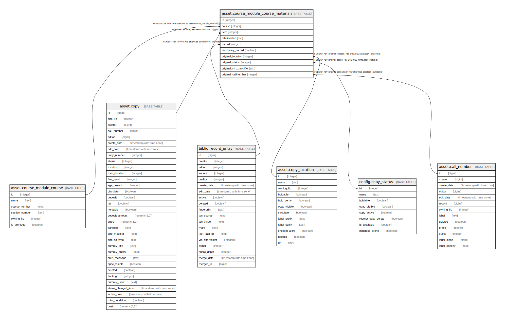

# asset.course_module_course_materials

## Description

## Columns

| Name | Type | Default | Nullable | Children | Parents | Comment |
| ---- | ---- | ------- | -------- | -------- | ------- | ------- |
| id | integer | nextval('asset.course_module_course_materials_id_seq'::regclass) | false |  |  |  |
| course | integer |  | false |  | [asset.course_module_course](asset.course_module_course.md) |  |
| item | integer |  | true |  | [asset.copy](asset.copy.md) |  |
| relationship | text |  | true |  |  |  |
| record | integer |  | true |  | [biblio.record_entry](biblio.record_entry.md) |  |
| temporary_record | boolean |  | true |  |  |  |
| original_location | integer |  | true |  | [asset.copy_location](asset.copy_location.md) |  |
| original_status | integer |  | true |  | [config.copy_status](config.copy_status.md) |  |
| original_circ_modifier | text |  | true |  |  |  |
| original_callnumber | integer |  | true |  | [asset.call_number](asset.call_number.md) |  |

## Constraints

| Name | Type | Definition |
| ---- | ---- | ---------- |
| course_module_course_materials_original_callnumber_fkey | FOREIGN KEY | FOREIGN KEY (original_callnumber) REFERENCES asset.call_number(id) |
| course_module_course_materials_original_location_fkey | FOREIGN KEY | FOREIGN KEY (original_location) REFERENCES asset.copy_location(id) |
| course_module_course_materials_item_fkey | FOREIGN KEY | FOREIGN KEY (item) REFERENCES asset.copy(id) |
| course_module_course_materials_course_item_record_key | UNIQUE | UNIQUE (course, item, record) |
| course_module_course_materials_pkey | PRIMARY KEY | PRIMARY KEY (id) |
| course_module_course_materials_course_fkey | FOREIGN KEY | FOREIGN KEY (course) REFERENCES asset.course_module_course(id) |
| course_module_course_materials_record_fkey | FOREIGN KEY | FOREIGN KEY (record) REFERENCES biblio.record_entry(id) |
| course_module_course_materials_original_status_fkey | FOREIGN KEY | FOREIGN KEY (original_status) REFERENCES config.copy_status(id) |

## Indexes

| Name | Definition |
| ---- | ---------- |
| course_module_course_materials_course_item_record_key | CREATE UNIQUE INDEX course_module_course_materials_course_item_record_key ON asset.course_module_course_materials USING btree (course, item, record) |
| course_module_course_materials_pkey | CREATE UNIQUE INDEX course_module_course_materials_pkey ON asset.course_module_course_materials USING btree (id) |

## Relations

---

> Generated by [tbls](https://github.com/k1LoW/tbls)
