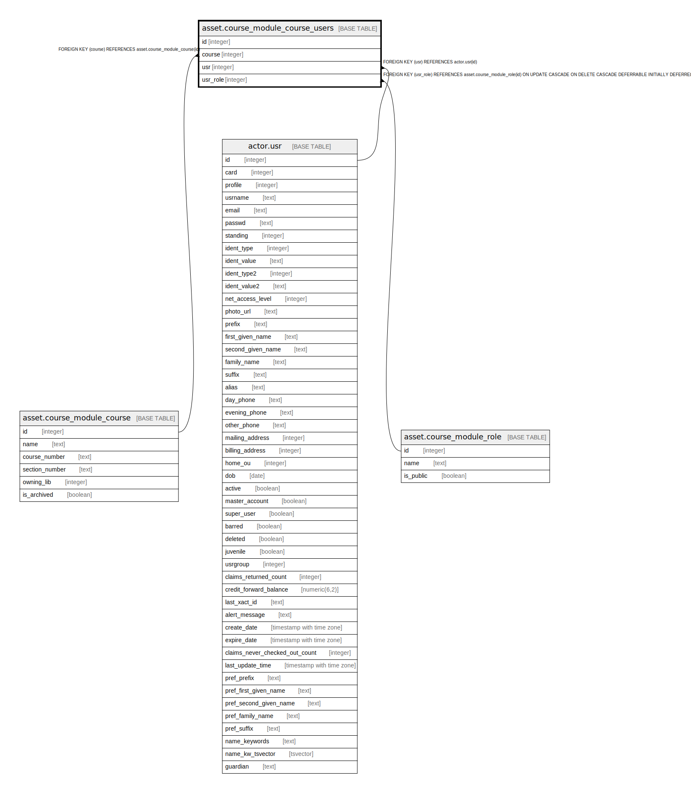

# asset.course_module_course_users

## Description

## Columns

| Name | Type | Default | Nullable | Children | Parents | Comment |
| ---- | ---- | ------- | -------- | -------- | ------- | ------- |
| id | integer | nextval('asset.course_module_course_users_id_seq'::regclass) | false |  |  |  |
| course | integer |  | false |  | [asset.course_module_course](asset.course_module_course.md) |  |
| usr | integer |  | false |  | [actor.usr](actor.usr.md) |  |
| usr_role | integer |  | true |  | [asset.course_module_role](asset.course_module_role.md) |  |

## Constraints

| Name | Type | Definition |
| ---- | ---- | ---------- |
| course_module_course_users_usr_fkey | FOREIGN KEY | FOREIGN KEY (usr) REFERENCES actor.usr(id) |
| course_module_course_users_course_fkey | FOREIGN KEY | FOREIGN KEY (course) REFERENCES asset.course_module_course(id) |
| course_module_course_users_pkey | PRIMARY KEY | PRIMARY KEY (id) |
| course_module_course_users_usr_role_fkey | FOREIGN KEY | FOREIGN KEY (usr_role) REFERENCES asset.course_module_role(id) ON UPDATE CASCADE ON DELETE CASCADE DEFERRABLE INITIALLY DEFERRED |

## Indexes

| Name | Definition |
| ---- | ---------- |
| course_module_course_users_pkey | CREATE UNIQUE INDEX course_module_course_users_pkey ON asset.course_module_course_users USING btree (id) |

## Relations

---

> Generated by [tbls](https://github.com/k1LoW/tbls)
