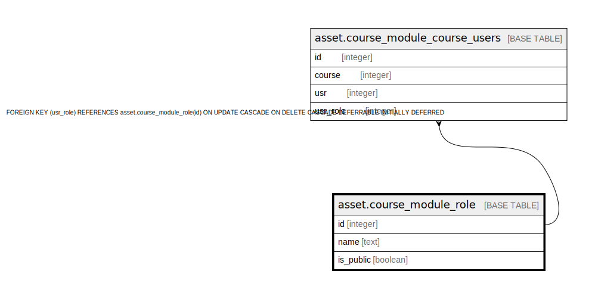

# asset.course_module_role

## Description

## Columns

| Name | Type | Default | Nullable | Children | Parents | Comment |
| ---- | ---- | ------- | -------- | -------- | ------- | ------- |
| id | integer | nextval('asset.course_module_role_id_seq'::regclass) | false | [asset.course_module_course_users](asset.course_module_course_users.md) |  |  |
| name | text |  | false |  |  |  |
| is_public | boolean | false | false |  |  |  |

## Constraints

| Name | Type | Definition |
| ---- | ---- | ---------- |
| course_module_role_name_key | UNIQUE | UNIQUE (name) |
| course_module_role_pkey | PRIMARY KEY | PRIMARY KEY (id) |

## Indexes

| Name | Definition |
| ---- | ---------- |
| course_module_role_name_key | CREATE UNIQUE INDEX course_module_role_name_key ON asset.course_module_role USING btree (name) |
| course_module_role_pkey | CREATE UNIQUE INDEX course_module_role_pkey ON asset.course_module_role USING btree (id) |

## Relations

---

> Generated by [tbls](https://github.com/k1LoW/tbls)
