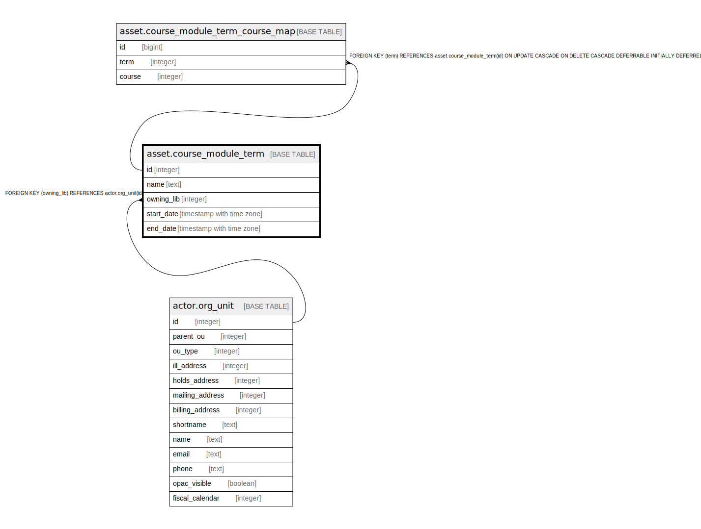

# asset.course_module_term

## Description

## Columns

| Name | Type | Default | Nullable | Children | Parents | Comment |
| ---- | ---- | ------- | -------- | -------- | ------- | ------- |
| id | integer | nextval('asset.course_module_term_id_seq'::regclass) | false | [asset.course_module_term_course_map](asset.course_module_term_course_map.md) |  |  |
| name | text |  | false |  |  |  |
| owning_lib | integer |  | true |  | [actor.org_unit](actor.org_unit.md) |  |
| start_date | timestamp with time zone |  | true |  |  |  |
| end_date | timestamp with time zone |  | true |  |  |  |

## Constraints

| Name | Type | Definition |
| ---- | ---- | ---------- |
| course_module_term_owning_lib_fkey | FOREIGN KEY | FOREIGN KEY (owning_lib) REFERENCES actor.org_unit(id) |
| course_module_term_name_key | UNIQUE | UNIQUE (name) |
| course_module_term_pkey | PRIMARY KEY | PRIMARY KEY (id) |

## Indexes

| Name | Definition |
| ---- | ---------- |
| course_module_term_name_key | CREATE UNIQUE INDEX course_module_term_name_key ON asset.course_module_term USING btree (name) |
| course_module_term_pkey | CREATE UNIQUE INDEX course_module_term_pkey ON asset.course_module_term USING btree (id) |

## Relations

---

> Generated by [tbls](https://github.com/k1LoW/tbls)
