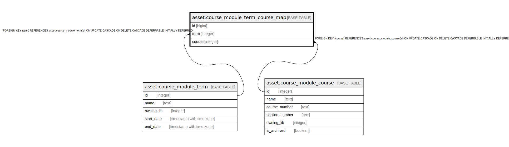

# asset.course_module_term_course_map

## Description

## Columns

| Name | Type | Default | Nullable | Children | Parents | Comment |
| ---- | ---- | ------- | -------- | -------- | ------- | ------- |
| id | bigint | nextval('asset.course_module_term_course_map_id_seq'::regclass) | false |  |  |  |
| term | integer |  | false |  | [asset.course_module_term](asset.course_module_term.md) |  |
| course | integer |  | false |  | [asset.course_module_course](asset.course_module_course.md) |  |

## Constraints

| Name | Type | Definition |
| ---- | ---- | ---------- |
| course_module_term_course_map_course_fkey | FOREIGN KEY | FOREIGN KEY (course) REFERENCES asset.course_module_course(id) ON UPDATE CASCADE ON DELETE CASCADE DEFERRABLE INITIALLY DEFERRED |
| course_module_term_course_map_pkey | PRIMARY KEY | PRIMARY KEY (id) |
| course_module_term_course_map_term_fkey | FOREIGN KEY | FOREIGN KEY (term) REFERENCES asset.course_module_term(id) ON UPDATE CASCADE ON DELETE CASCADE DEFERRABLE INITIALLY DEFERRED |

## Indexes

| Name | Definition |
| ---- | ---------- |
| course_module_term_course_map_pkey | CREATE UNIQUE INDEX course_module_term_course_map_pkey ON asset.course_module_term_course_map USING btree (id) |

## Relations

---

> Generated by [tbls](https://github.com/k1LoW/tbls)
