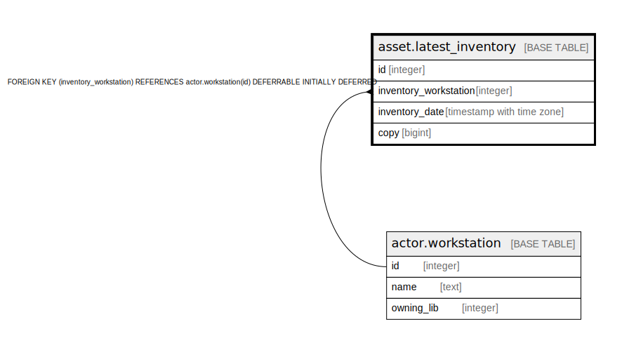

# asset.latest_inventory

## Description

## Columns

| Name | Type | Default | Nullable | Children | Parents | Comment |
| ---- | ---- | ------- | -------- | -------- | ------- | ------- |
| id | integer | nextval('asset.latest_inventory_id_seq'::regclass) | false |  |  |  |
| inventory_workstation | integer |  | true |  | [actor.workstation](actor.workstation.md) |  |
| inventory_date | timestamp with time zone | now() | true |  |  |  |
| copy | bigint |  | false |  |  |  |

## Constraints

| Name | Type | Definition |
| ---- | ---- | ---------- |
| inherit_asset_latest_inventory_copy_fkey | TRIGGER | CREATE CONSTRAINT TRIGGER inherit_asset_latest_inventory_copy_fkey AFTER INSERT OR UPDATE ON asset.latest_inventory DEFERRABLE INITIALLY IMMEDIATE FOR EACH ROW EXECUTE PROCEDURE asset_latest_inventory_copy_inh_fkey() |
| latest_inventory_inventory_workstation_fkey | FOREIGN KEY | FOREIGN KEY (inventory_workstation) REFERENCES actor.workstation(id) DEFERRABLE INITIALLY DEFERRED |
| latest_inventory_pkey | PRIMARY KEY | PRIMARY KEY (id) |

## Indexes

| Name | Definition |
| ---- | ---------- |
| latest_inventory_pkey | CREATE UNIQUE INDEX latest_inventory_pkey ON asset.latest_inventory USING btree (id) |
| latest_inventory_copy_idx | CREATE INDEX latest_inventory_copy_idx ON asset.latest_inventory USING btree (copy) |

## Triggers

| Name | Definition |
| ---- | ---------- |
| inherit_asset_latest_inventory_copy_fkey | CREATE CONSTRAINT TRIGGER inherit_asset_latest_inventory_copy_fkey AFTER INSERT OR UPDATE ON asset.latest_inventory DEFERRABLE INITIALLY IMMEDIATE FOR EACH ROW EXECUTE PROCEDURE asset_latest_inventory_copy_inh_fkey() |

## Relations

---

> Generated by [tbls](https://github.com/k1LoW/tbls)
