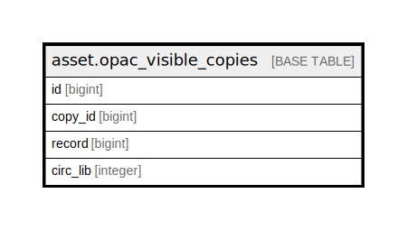

# asset.opac_visible_copies

## Description

  
Materialized view of copies that are visible in the OPAC, used by  
search.query_parser_fts() to speed up OPAC visibility checks on large  
databases.  Contents are maintained by a set of triggers.  

## Columns

| Name | Type | Default | Nullable | Children | Parents | Comment |
| ---- | ---- | ------- | -------- | -------- | ------- | ------- |
| id | bigint | nextval('asset.opac_visible_copies_id_seq'::regclass) | false |  |  |  |
| copy_id | bigint |  | true |  |  |  |
| record | bigint |  | true |  |  |  |
| circ_lib | integer |  | true |  |  |  |

## Constraints

| Name | Type | Definition |
| ---- | ---- | ---------- |
| opac_visible_copies_pkey | PRIMARY KEY | PRIMARY KEY (id) |

## Indexes

| Name | Definition |
| ---- | ---------- |
| opac_visible_copies_pkey | CREATE UNIQUE INDEX opac_visible_copies_pkey ON asset.opac_visible_copies USING btree (id) |
| opac_visible_copies_copy_id_idx | CREATE INDEX opac_visible_copies_copy_id_idx ON asset.opac_visible_copies USING btree (copy_id) |
| opac_visible_copies_idx1 | CREATE INDEX opac_visible_copies_idx1 ON asset.opac_visible_copies USING btree (record, circ_lib) |
| opac_visible_copies_once_per_record_idx | CREATE UNIQUE INDEX opac_visible_copies_once_per_record_idx ON asset.opac_visible_copies USING btree (copy_id, record) |

## Relations

---

> Generated by [tbls](https://github.com/k1LoW/tbls)
