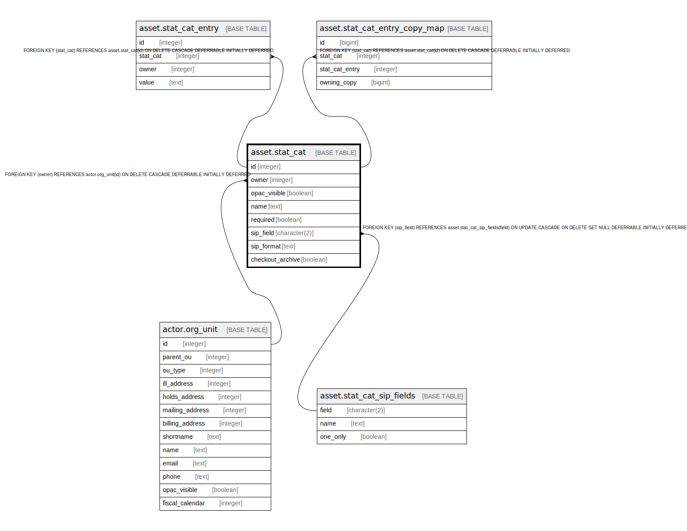

# asset.stat_cat

## Description

## Columns

| Name | Type | Default | Nullable | Children | Parents | Comment |
| ---- | ---- | ------- | -------- | -------- | ------- | ------- |
| id | integer | nextval('asset.stat_cat_id_seq'::regclass) | false | [asset.stat_cat_entry](asset.stat_cat_entry.md) [asset.stat_cat_entry_copy_map](asset.stat_cat_entry_copy_map.md) |  |  |
| owner | integer |  | false |  | [actor.org_unit](actor.org_unit.md) |  |
| opac_visible | boolean | false | false |  |  |  |
| name | text |  | false |  |  |  |
| required | boolean | false | false |  |  |  |
| sip_field | character(2) |  | true |  | [asset.stat_cat_sip_fields](asset.stat_cat_sip_fields.md) |  |
| sip_format | text |  | true |  |  |  |
| checkout_archive | boolean | false | false |  |  |  |

## Constraints

| Name | Type | Definition |
| ---- | ---- | ---------- |
| a_sc_owner_fkey | FOREIGN KEY | FOREIGN KEY (owner) REFERENCES actor.org_unit(id) ON DELETE CASCADE DEFERRABLE INITIALLY DEFERRED |
| sc_once_per_owner | UNIQUE | UNIQUE (owner, name) |
| stat_cat_pkey | PRIMARY KEY | PRIMARY KEY (id) |
| stat_cat_sip_field_fkey | FOREIGN KEY | FOREIGN KEY (sip_field) REFERENCES asset.stat_cat_sip_fields(field) ON UPDATE CASCADE ON DELETE SET NULL DEFERRABLE INITIALLY DEFERRED |

## Indexes

| Name | Definition |
| ---- | ---------- |
| sc_once_per_owner | CREATE UNIQUE INDEX sc_once_per_owner ON asset.stat_cat USING btree (owner, name) |
| stat_cat_pkey | CREATE UNIQUE INDEX stat_cat_pkey ON asset.stat_cat USING btree (id) |

## Triggers

| Name | Definition |
| ---- | ---------- |
| asset_stat_cat_sip_update_trigger | CREATE TRIGGER asset_stat_cat_sip_update_trigger BEFORE INSERT OR UPDATE ON asset.stat_cat FOR EACH ROW EXECUTE PROCEDURE asset.stat_cat_check() |

## Relations

---

> Generated by [tbls](https://github.com/k1LoW/tbls)
