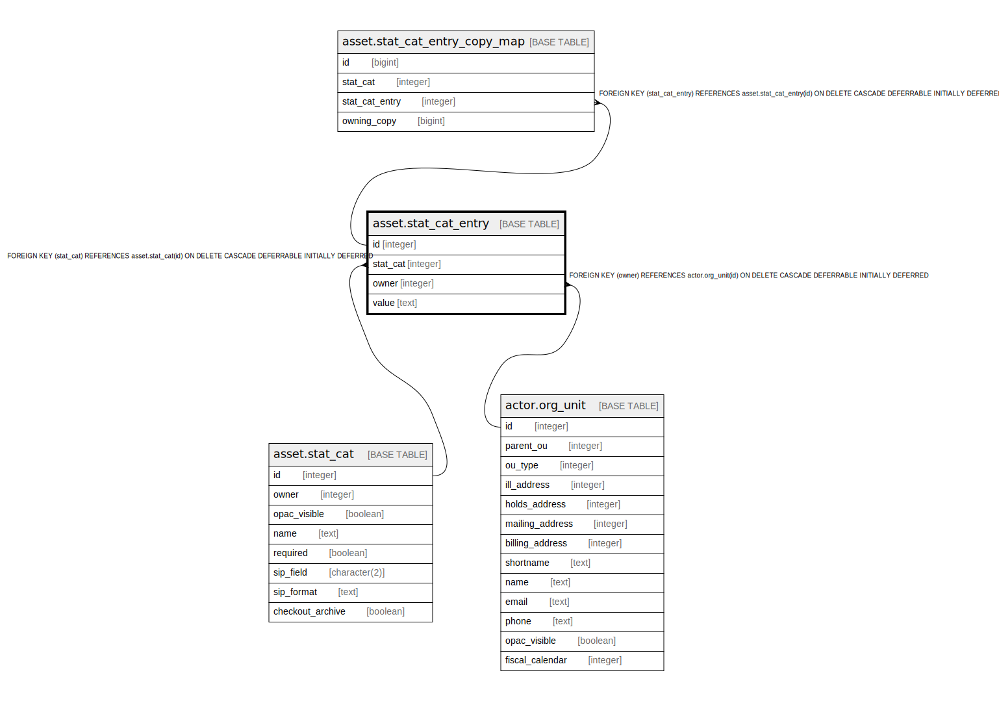

# asset.stat_cat_entry

## Description

## Columns

| Name | Type | Default | Nullable | Children | Parents | Comment |
| ---- | ---- | ------- | -------- | -------- | ------- | ------- |
| id | integer | nextval('asset.stat_cat_entry_id_seq'::regclass) | false | [asset.stat_cat_entry_copy_map](asset.stat_cat_entry_copy_map.md) |  |  |
| stat_cat | integer |  | false |  | [asset.stat_cat](asset.stat_cat.md) |  |
| owner | integer |  | false |  | [actor.org_unit](actor.org_unit.md) |  |
| value | text |  | false |  |  |  |

## Constraints

| Name | Type | Definition |
| ---- | ---- | ---------- |
| a_sce_owner_fkey | FOREIGN KEY | FOREIGN KEY (owner) REFERENCES actor.org_unit(id) ON DELETE CASCADE DEFERRABLE INITIALLY DEFERRED |
| sce_once_per_owner | UNIQUE | UNIQUE (stat_cat, owner, value) |
| stat_cat_entry_pkey | PRIMARY KEY | PRIMARY KEY (id) |
| a_sce_sc_fkey | FOREIGN KEY | FOREIGN KEY (stat_cat) REFERENCES asset.stat_cat(id) ON DELETE CASCADE DEFERRABLE INITIALLY DEFERRED |

## Indexes

| Name | Definition |
| ---- | ---------- |
| sce_once_per_owner | CREATE UNIQUE INDEX sce_once_per_owner ON asset.stat_cat_entry USING btree (stat_cat, owner, value) |
| stat_cat_entry_pkey | CREATE UNIQUE INDEX stat_cat_entry_pkey ON asset.stat_cat_entry USING btree (id) |

## Relations

---

> Generated by [tbls](https://github.com/k1LoW/tbls)
