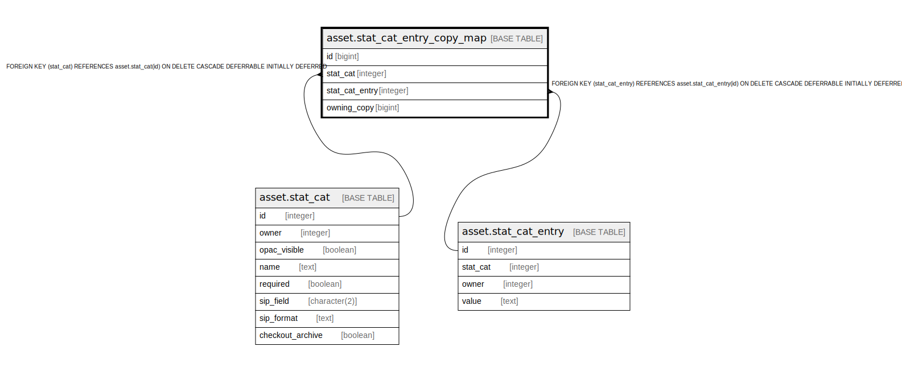

# asset.stat_cat_entry_copy_map

## Description

## Columns

| Name | Type | Default | Nullable | Children | Parents | Comment |
| ---- | ---- | ------- | -------- | -------- | ------- | ------- |
| id | bigint | nextval('asset.stat_cat_entry_copy_map_id_seq'::regclass) | false |  |  |  |
| stat_cat | integer |  | false |  | [asset.stat_cat](asset.stat_cat.md) |  |
| stat_cat_entry | integer |  | false |  | [asset.stat_cat_entry](asset.stat_cat_entry.md) |  |
| owning_copy | bigint |  | false |  |  |  |

## Constraints

| Name | Type | Definition |
| ---- | ---- | ---------- |
| sce_once_per_copy | UNIQUE | UNIQUE (owning_copy, stat_cat) |
| stat_cat_entry_copy_map_pkey | PRIMARY KEY | PRIMARY KEY (id) |
| a_sc_sce_fkey | FOREIGN KEY | FOREIGN KEY (stat_cat_entry) REFERENCES asset.stat_cat_entry(id) ON DELETE CASCADE DEFERRABLE INITIALLY DEFERRED |
| a_sc_sc_fkey | FOREIGN KEY | FOREIGN KEY (stat_cat) REFERENCES asset.stat_cat(id) ON DELETE CASCADE DEFERRABLE INITIALLY DEFERRED |

## Indexes

| Name | Definition |
| ---- | ---------- |
| sce_once_per_copy | CREATE UNIQUE INDEX sce_once_per_copy ON asset.stat_cat_entry_copy_map USING btree (owning_copy, stat_cat) |
| stat_cat_entry_copy_map_pkey | CREATE UNIQUE INDEX stat_cat_entry_copy_map_pkey ON asset.stat_cat_entry_copy_map USING btree (id) |
| scecm_owning_copy_idx | CREATE INDEX scecm_owning_copy_idx ON asset.stat_cat_entry_copy_map USING btree (owning_copy) |

## Relations

---

> Generated by [tbls](https://github.com/k1LoW/tbls)
