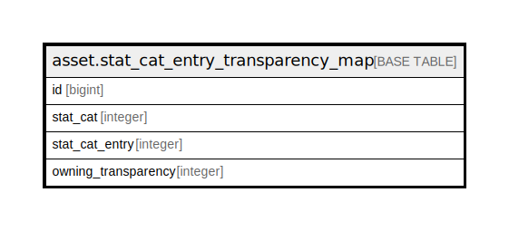

# asset.stat_cat_entry_transparency_map

## Description

## Columns

| Name | Type | Default | Nullable | Children | Parents | Comment |
| ---- | ---- | ------- | -------- | -------- | ------- | ------- |
| id | bigint | nextval('asset.stat_cat_entry_transparency_map_id_seq'::regclass) | false |  |  |  |
| stat_cat | integer |  | false |  |  |  |
| stat_cat_entry | integer |  | false |  |  |  |
| owning_transparency | integer |  | false |  |  |  |

## Constraints

| Name | Type | Definition |
| ---- | ---- | ---------- |
| scte_once_per_trans | UNIQUE | UNIQUE (owning_transparency, stat_cat) |
| stat_cat_entry_transparency_map_pkey | PRIMARY KEY | PRIMARY KEY (id) |

## Indexes

| Name | Definition |
| ---- | ---------- |
| scte_once_per_trans | CREATE UNIQUE INDEX scte_once_per_trans ON asset.stat_cat_entry_transparency_map USING btree (owning_transparency, stat_cat) |
| stat_cat_entry_transparency_map_pkey | CREATE UNIQUE INDEX stat_cat_entry_transparency_map_pkey ON asset.stat_cat_entry_transparency_map USING btree (id) |

## Relations

---

> Generated by [tbls](https://github.com/k1LoW/tbls)
