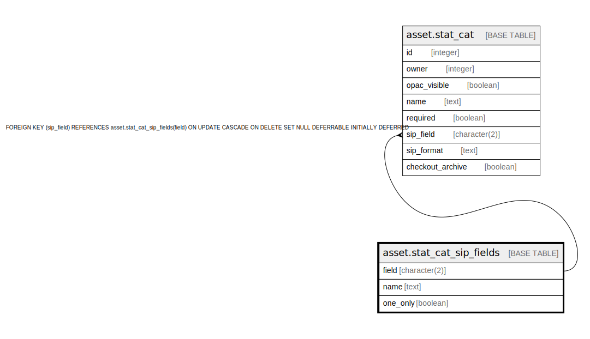

# asset.stat_cat_sip_fields

## Description

  
Asset Statistical Category SIP Fields  
  
Contains the list of valid SIP Field identifiers for  
Statistical Categories.  

## Columns

| Name | Type | Default | Nullable | Children | Parents | Comment |
| ---- | ---- | ------- | -------- | -------- | ------- | ------- |
| field | character(2) |  | false | [asset.stat_cat](asset.stat_cat.md) |  |  |
| name | text |  | false |  |  |  |
| one_only | boolean | false | false |  |  |  |

## Constraints

| Name | Type | Definition |
| ---- | ---- | ---------- |
| stat_cat_sip_fields_pkey | PRIMARY KEY | PRIMARY KEY (field) |

## Indexes

| Name | Definition |
| ---- | ---------- |
| stat_cat_sip_fields_pkey | CREATE UNIQUE INDEX stat_cat_sip_fields_pkey ON asset.stat_cat_sip_fields USING btree (field) |

## Relations

---

> Generated by [tbls](https://github.com/k1LoW/tbls)
