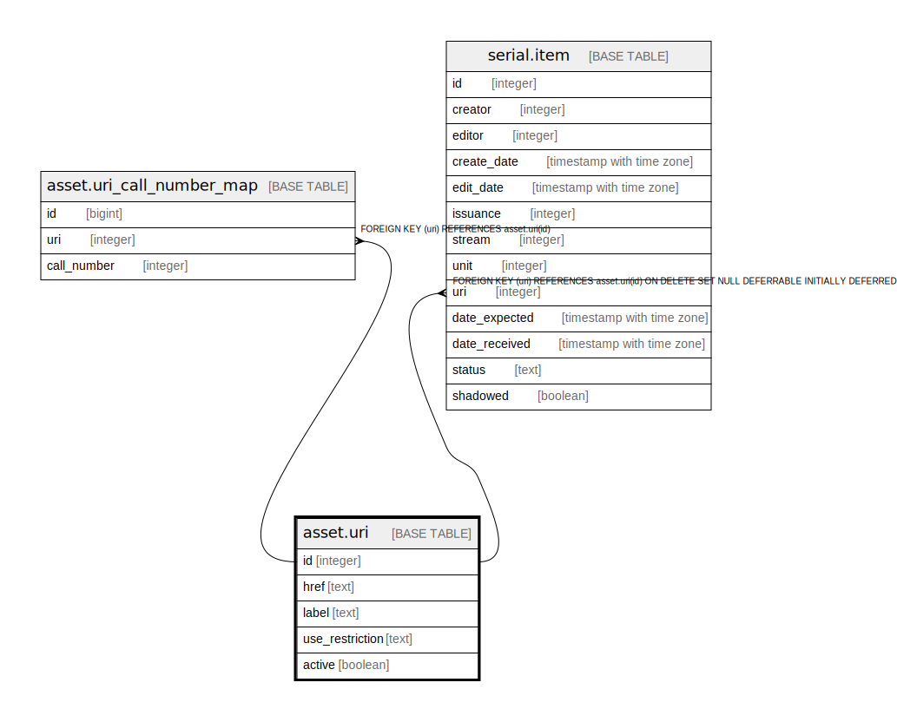

# asset.uri

## Description

## Columns

| Name | Type | Default | Nullable | Children | Parents | Comment |
| ---- | ---- | ------- | -------- | -------- | ------- | ------- |
| id | integer | nextval('asset.uri_id_seq'::regclass) | false | [asset.uri_call_number_map](asset.uri_call_number_map.md) [serial.item](serial.item.md) |  |  |
| href | text |  | false |  |  |  |
| label | text |  | true |  |  |  |
| use_restriction | text |  | true |  |  |  |
| active | boolean | true | false |  |  |  |

## Constraints

| Name | Type | Definition |
| ---- | ---- | ---------- |
| uri_pkey | PRIMARY KEY | PRIMARY KEY (id) |

## Indexes

| Name | Definition |
| ---- | ---------- |
| uri_pkey | CREATE UNIQUE INDEX uri_pkey ON asset.uri USING btree (id) |

## Relations

---

> Generated by [tbls](https://github.com/k1LoW/tbls)
