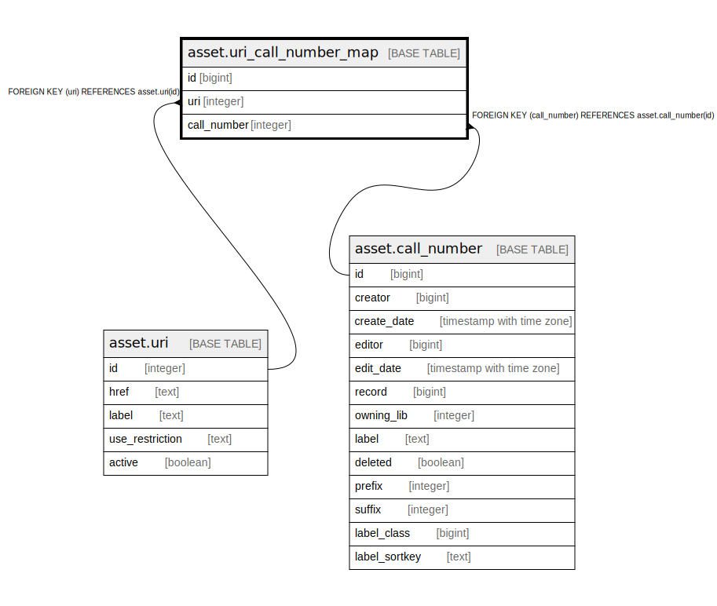

# asset.uri_call_number_map

## Description

## Columns

| Name | Type | Default | Nullable | Children | Parents | Comment |
| ---- | ---- | ------- | -------- | -------- | ------- | ------- |
| id | bigint | nextval('asset.uri_call_number_map_id_seq'::regclass) | false |  |  |  |
| uri | integer |  | false |  | [asset.uri](asset.uri.md) |  |
| call_number | integer |  | false |  | [asset.call_number](asset.call_number.md) |  |

## Constraints

| Name | Type | Definition |
| ---- | ---- | ---------- |
| uri_call_number_map_call_number_fkey | FOREIGN KEY | FOREIGN KEY (call_number) REFERENCES asset.call_number(id) |
| uri_call_number_map_pkey | PRIMARY KEY | PRIMARY KEY (id) |
| uri_cn_once | UNIQUE | UNIQUE (uri, call_number) |
| uri_call_number_map_uri_fkey | FOREIGN KEY | FOREIGN KEY (uri) REFERENCES asset.uri(id) |

## Indexes

| Name | Definition |
| ---- | ---------- |
| uri_call_number_map_pkey | CREATE UNIQUE INDEX uri_call_number_map_pkey ON asset.uri_call_number_map USING btree (id) |
| uri_cn_once | CREATE UNIQUE INDEX uri_cn_once ON asset.uri_call_number_map USING btree (uri, call_number) |
| asset_uri_call_number_map_cn_idx | CREATE INDEX asset_uri_call_number_map_cn_idx ON asset.uri_call_number_map USING btree (call_number) |

## Relations

---

> Generated by [tbls](https://github.com/k1LoW/tbls)
