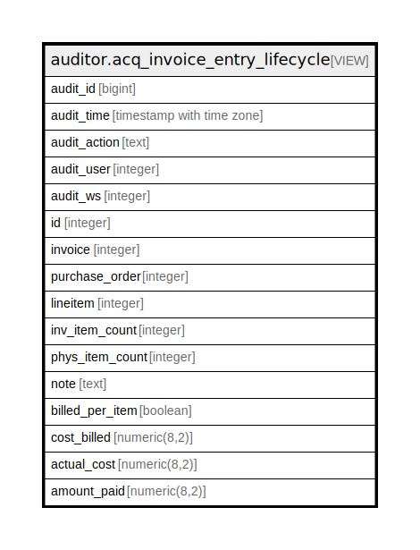

# auditor.acq_invoice_entry_lifecycle

## Description

<details>
<summary><strong>Table Definition</strong></summary>

```sql
CREATE VIEW acq_invoice_entry_lifecycle AS (
 SELECT '-1'::integer AS audit_id,
    now() AS audit_time,
    '-'::text AS audit_action,
    '-1'::integer AS audit_user,
    '-1'::integer AS audit_ws,
    invoice_entry.id,
    invoice_entry.invoice,
    invoice_entry.purchase_order,
    invoice_entry.lineitem,
    invoice_entry.inv_item_count,
    invoice_entry.phys_item_count,
    invoice_entry.note,
    invoice_entry.billed_per_item,
    invoice_entry.cost_billed,
    invoice_entry.actual_cost,
    invoice_entry.amount_paid
   FROM acq.invoice_entry
UNION ALL
 SELECT acq_invoice_entry_history.audit_id,
    acq_invoice_entry_history.audit_time,
    acq_invoice_entry_history.audit_action,
    acq_invoice_entry_history.audit_user,
    acq_invoice_entry_history.audit_ws,
    acq_invoice_entry_history.id,
    acq_invoice_entry_history.invoice,
    acq_invoice_entry_history.purchase_order,
    acq_invoice_entry_history.lineitem,
    acq_invoice_entry_history.inv_item_count,
    acq_invoice_entry_history.phys_item_count,
    acq_invoice_entry_history.note,
    acq_invoice_entry_history.billed_per_item,
    acq_invoice_entry_history.cost_billed,
    acq_invoice_entry_history.actual_cost,
    acq_invoice_entry_history.amount_paid
   FROM auditor.acq_invoice_entry_history
)
```

</details>

## Columns

| Name | Type | Default | Nullable | Children | Parents | Comment |
| ---- | ---- | ------- | -------- | -------- | ------- | ------- |
| audit_id | bigint |  | true |  |  |  |
| audit_time | timestamp with time zone |  | true |  |  |  |
| audit_action | text |  | true |  |  |  |
| audit_user | integer |  | true |  |  |  |
| audit_ws | integer |  | true |  |  |  |
| id | integer |  | true |  |  |  |
| invoice | integer |  | true |  |  |  |
| purchase_order | integer |  | true |  |  |  |
| lineitem | integer |  | true |  |  |  |
| inv_item_count | integer |  | true |  |  |  |
| phys_item_count | integer |  | true |  |  |  |
| note | text |  | true |  |  |  |
| billed_per_item | boolean |  | true |  |  |  |
| cost_billed | numeric(8,2) |  | true |  |  |  |
| actual_cost | numeric(8,2) |  | true |  |  |  |
| amount_paid | numeric(8,2) |  | true |  |  |  |

## Referenced Tables

| Name | Columns | Comment | Type |
| ---- | ------- | ------- | ---- |
| [acq.invoice_entry](acq.invoice_entry.md) | 11 |  | BASE TABLE |
| [auditor.acq_invoice_entry_history](auditor.acq_invoice_entry_history.md) | 16 |  | BASE TABLE |

## Relations



---

> Generated by [tbls](https://github.com/k1LoW/tbls)
