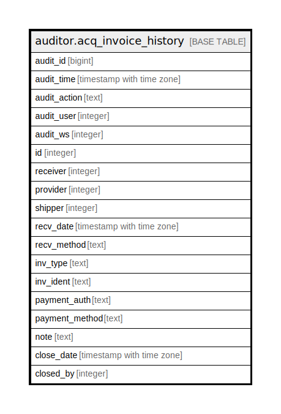

# auditor.acq_invoice_history

## Description

## Columns

| Name | Type | Default | Nullable | Children | Parents | Comment |
| ---- | ---- | ------- | -------- | -------- | ------- | ------- |
| audit_id | bigint |  | false |  |  |  |
| audit_time | timestamp with time zone |  | false |  |  |  |
| audit_action | text |  | false |  |  |  |
| audit_user | integer |  | true |  |  |  |
| audit_ws | integer |  | true |  |  |  |
| id | integer |  | false |  |  |  |
| receiver | integer |  | false |  |  |  |
| provider | integer |  | false |  |  |  |
| shipper | integer |  | false |  |  |  |
| recv_date | timestamp with time zone |  | false |  |  |  |
| recv_method | text |  | false |  |  |  |
| inv_type | text |  | true |  |  |  |
| inv_ident | text |  | false |  |  |  |
| payment_auth | text |  | true |  |  |  |
| payment_method | text |  | true |  |  |  |
| note | text |  | true |  |  |  |
| close_date | timestamp with time zone |  | true |  |  |  |
| closed_by | integer |  | true |  |  |  |

## Constraints

| Name | Type | Definition |
| ---- | ---- | ---------- |
| acq_invoice_history_pkey | PRIMARY KEY | PRIMARY KEY (audit_id) |

## Indexes

| Name | Definition |
| ---- | ---------- |
| acq_invoice_history_pkey | CREATE UNIQUE INDEX acq_invoice_history_pkey ON auditor.acq_invoice_history USING btree (audit_id) |

## Relations

---

> Generated by [tbls](https://github.com/k1LoW/tbls)
