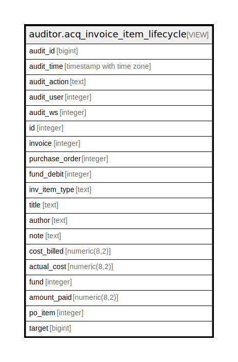

# auditor.acq_invoice_item_lifecycle

## Description

<details>
<summary><strong>Table Definition</strong></summary>

```sql
CREATE VIEW acq_invoice_item_lifecycle AS (
 SELECT '-1'::integer AS audit_id,
    now() AS audit_time,
    '-'::text AS audit_action,
    '-1'::integer AS audit_user,
    '-1'::integer AS audit_ws,
    invoice_item.id,
    invoice_item.invoice,
    invoice_item.purchase_order,
    invoice_item.fund_debit,
    invoice_item.inv_item_type,
    invoice_item.title,
    invoice_item.author,
    invoice_item.note,
    invoice_item.cost_billed,
    invoice_item.actual_cost,
    invoice_item.fund,
    invoice_item.amount_paid,
    invoice_item.po_item,
    invoice_item.target
   FROM acq.invoice_item
UNION ALL
 SELECT acq_invoice_item_history.audit_id,
    acq_invoice_item_history.audit_time,
    acq_invoice_item_history.audit_action,
    acq_invoice_item_history.audit_user,
    acq_invoice_item_history.audit_ws,
    acq_invoice_item_history.id,
    acq_invoice_item_history.invoice,
    acq_invoice_item_history.purchase_order,
    acq_invoice_item_history.fund_debit,
    acq_invoice_item_history.inv_item_type,
    acq_invoice_item_history.title,
    acq_invoice_item_history.author,
    acq_invoice_item_history.note,
    acq_invoice_item_history.cost_billed,
    acq_invoice_item_history.actual_cost,
    acq_invoice_item_history.fund,
    acq_invoice_item_history.amount_paid,
    acq_invoice_item_history.po_item,
    acq_invoice_item_history.target
   FROM auditor.acq_invoice_item_history
)
```

</details>

## Columns

| Name | Type | Default | Nullable | Children | Parents | Comment |
| ---- | ---- | ------- | -------- | -------- | ------- | ------- |
| audit_id | bigint |  | true |  |  |  |
| audit_time | timestamp with time zone |  | true |  |  |  |
| audit_action | text |  | true |  |  |  |
| audit_user | integer |  | true |  |  |  |
| audit_ws | integer |  | true |  |  |  |
| id | integer |  | true |  |  |  |
| invoice | integer |  | true |  |  |  |
| purchase_order | integer |  | true |  |  |  |
| fund_debit | integer |  | true |  |  |  |
| inv_item_type | text |  | true |  |  |  |
| title | text |  | true |  |  |  |
| author | text |  | true |  |  |  |
| note | text |  | true |  |  |  |
| cost_billed | numeric(8,2) |  | true |  |  |  |
| actual_cost | numeric(8,2) |  | true |  |  |  |
| fund | integer |  | true |  |  |  |
| amount_paid | numeric(8,2) |  | true |  |  |  |
| po_item | integer |  | true |  |  |  |
| target | bigint |  | true |  |  |  |

## Referenced Tables

| Name | Columns | Comment | Type |
| ---- | ------- | ------- | ---- |
| [acq.invoice_item](acq.invoice_item.md) | 14 |  | BASE TABLE |
| [auditor.acq_invoice_item_history](auditor.acq_invoice_item_history.md) | 19 |  | BASE TABLE |

## Relations



---

> Generated by [tbls](https://github.com/k1LoW/tbls)
