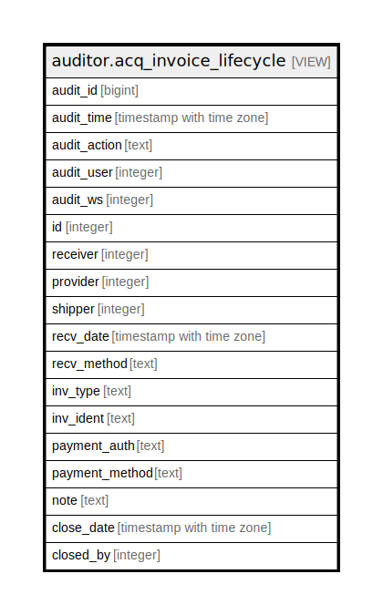

# auditor.acq_invoice_lifecycle

## Description

<details>
<summary><strong>Table Definition</strong></summary>

```sql
CREATE VIEW acq_invoice_lifecycle AS (
 SELECT '-1'::integer AS audit_id,
    now() AS audit_time,
    '-'::text AS audit_action,
    '-1'::integer AS audit_user,
    '-1'::integer AS audit_ws,
    invoice.id,
    invoice.receiver,
    invoice.provider,
    invoice.shipper,
    invoice.recv_date,
    invoice.recv_method,
    invoice.inv_type,
    invoice.inv_ident,
    invoice.payment_auth,
    invoice.payment_method,
    invoice.note,
    invoice.close_date,
    invoice.closed_by
   FROM acq.invoice
UNION ALL
 SELECT acq_invoice_history.audit_id,
    acq_invoice_history.audit_time,
    acq_invoice_history.audit_action,
    acq_invoice_history.audit_user,
    acq_invoice_history.audit_ws,
    acq_invoice_history.id,
    acq_invoice_history.receiver,
    acq_invoice_history.provider,
    acq_invoice_history.shipper,
    acq_invoice_history.recv_date,
    acq_invoice_history.recv_method,
    acq_invoice_history.inv_type,
    acq_invoice_history.inv_ident,
    acq_invoice_history.payment_auth,
    acq_invoice_history.payment_method,
    acq_invoice_history.note,
    acq_invoice_history.close_date,
    acq_invoice_history.closed_by
   FROM auditor.acq_invoice_history
)
```

</details>

## Columns

| Name | Type | Default | Nullable | Children | Parents | Comment |
| ---- | ---- | ------- | -------- | -------- | ------- | ------- |
| audit_id | bigint |  | true |  |  |  |
| audit_time | timestamp with time zone |  | true |  |  |  |
| audit_action | text |  | true |  |  |  |
| audit_user | integer |  | true |  |  |  |
| audit_ws | integer |  | true |  |  |  |
| id | integer |  | true |  |  |  |
| receiver | integer |  | true |  |  |  |
| provider | integer |  | true |  |  |  |
| shipper | integer |  | true |  |  |  |
| recv_date | timestamp with time zone |  | true |  |  |  |
| recv_method | text |  | true |  |  |  |
| inv_type | text |  | true |  |  |  |
| inv_ident | text |  | true |  |  |  |
| payment_auth | text |  | true |  |  |  |
| payment_method | text |  | true |  |  |  |
| note | text |  | true |  |  |  |
| close_date | timestamp with time zone |  | true |  |  |  |
| closed_by | integer |  | true |  |  |  |

## Referenced Tables

| Name | Columns | Comment | Type |
| ---- | ------- | ------- | ---- |
| [acq.invoice](acq.invoice.md) | 13 |  | BASE TABLE |
| [auditor.acq_invoice_history](auditor.acq_invoice_history.md) | 18 |  | BASE TABLE |

## Relations



---

> Generated by [tbls](https://github.com/k1LoW/tbls)
