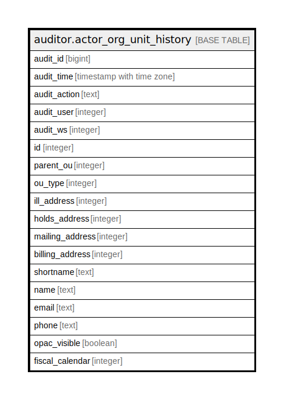

# auditor.actor_org_unit_history

## Description

## Columns

| Name | Type | Default | Nullable | Children | Parents | Comment |
| ---- | ---- | ------- | -------- | -------- | ------- | ------- |
| audit_id | bigint |  | false |  |  |  |
| audit_time | timestamp with time zone |  | false |  |  |  |
| audit_action | text |  | false |  |  |  |
| audit_user | integer |  | true |  |  |  |
| audit_ws | integer |  | true |  |  |  |
| id | integer |  | false |  |  |  |
| parent_ou | integer |  | true |  |  |  |
| ou_type | integer |  | false |  |  |  |
| ill_address | integer |  | true |  |  |  |
| holds_address | integer |  | true |  |  |  |
| mailing_address | integer |  | true |  |  |  |
| billing_address | integer |  | true |  |  |  |
| shortname | text |  | false |  |  |  |
| name | text |  | false |  |  |  |
| email | text |  | true |  |  |  |
| phone | text |  | true |  |  |  |
| opac_visible | boolean |  | false |  |  |  |
| fiscal_calendar | integer |  | false |  |  |  |

## Constraints

| Name | Type | Definition |
| ---- | ---- | ---------- |
| actor_org_unit_history_pkey | PRIMARY KEY | PRIMARY KEY (audit_id) |

## Indexes

| Name | Definition |
| ---- | ---------- |
| actor_org_unit_history_pkey | CREATE UNIQUE INDEX actor_org_unit_history_pkey ON auditor.actor_org_unit_history USING btree (audit_id) |

## Relations

---

> Generated by [tbls](https://github.com/k1LoW/tbls)
