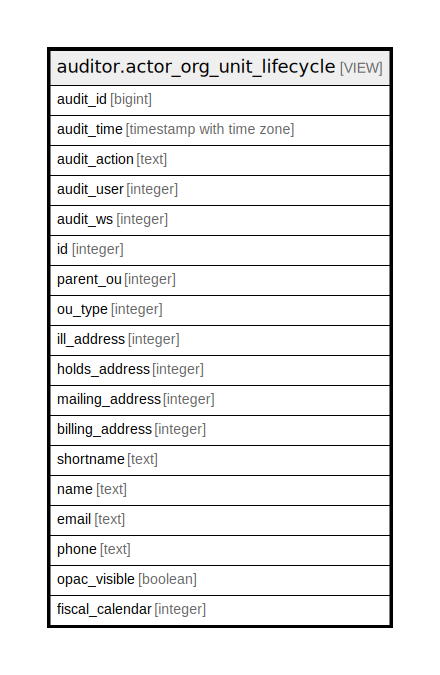

# auditor.actor_org_unit_lifecycle

## Description

<details>
<summary><strong>Table Definition</strong></summary>

```sql
CREATE VIEW actor_org_unit_lifecycle AS (
 SELECT '-1'::integer AS audit_id,
    now() AS audit_time,
    '-'::text AS audit_action,
    '-1'::integer AS audit_user,
    '-1'::integer AS audit_ws,
    org_unit.id,
    org_unit.parent_ou,
    org_unit.ou_type,
    org_unit.ill_address,
    org_unit.holds_address,
    org_unit.mailing_address,
    org_unit.billing_address,
    org_unit.shortname,
    org_unit.name,
    org_unit.email,
    org_unit.phone,
    org_unit.opac_visible,
    org_unit.fiscal_calendar
   FROM actor.org_unit
UNION ALL
 SELECT actor_org_unit_history.audit_id,
    actor_org_unit_history.audit_time,
    actor_org_unit_history.audit_action,
    actor_org_unit_history.audit_user,
    actor_org_unit_history.audit_ws,
    actor_org_unit_history.id,
    actor_org_unit_history.parent_ou,
    actor_org_unit_history.ou_type,
    actor_org_unit_history.ill_address,
    actor_org_unit_history.holds_address,
    actor_org_unit_history.mailing_address,
    actor_org_unit_history.billing_address,
    actor_org_unit_history.shortname,
    actor_org_unit_history.name,
    actor_org_unit_history.email,
    actor_org_unit_history.phone,
    actor_org_unit_history.opac_visible,
    actor_org_unit_history.fiscal_calendar
   FROM auditor.actor_org_unit_history
)
```

</details>

## Columns

| Name | Type | Default | Nullable | Children | Parents | Comment |
| ---- | ---- | ------- | -------- | -------- | ------- | ------- |
| audit_id | bigint |  | true |  |  |  |
| audit_time | timestamp with time zone |  | true |  |  |  |
| audit_action | text |  | true |  |  |  |
| audit_user | integer |  | true |  |  |  |
| audit_ws | integer |  | true |  |  |  |
| id | integer |  | true |  |  |  |
| parent_ou | integer |  | true |  |  |  |
| ou_type | integer |  | true |  |  |  |
| ill_address | integer |  | true |  |  |  |
| holds_address | integer |  | true |  |  |  |
| mailing_address | integer |  | true |  |  |  |
| billing_address | integer |  | true |  |  |  |
| shortname | text |  | true |  |  |  |
| name | text |  | true |  |  |  |
| email | text |  | true |  |  |  |
| phone | text |  | true |  |  |  |
| opac_visible | boolean |  | true |  |  |  |
| fiscal_calendar | integer |  | true |  |  |  |

## Referenced Tables

| Name | Columns | Comment | Type |
| ---- | ------- | ------- | ---- |
| [actor.org_unit](actor.org_unit.md) | 13 |  | BASE TABLE |
| [auditor.actor_org_unit_history](auditor.actor_org_unit_history.md) | 18 |  | BASE TABLE |

## Relations



---

> Generated by [tbls](https://github.com/k1LoW/tbls)
