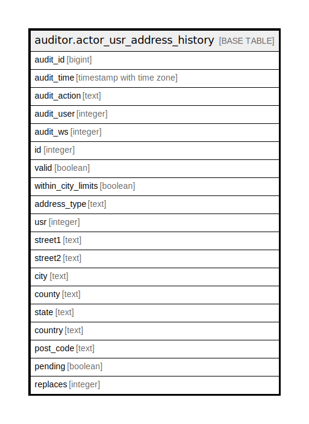

# auditor.actor_usr_address_history

## Description

## Columns

| Name | Type | Default | Nullable | Children | Parents | Comment |
| ---- | ---- | ------- | -------- | -------- | ------- | ------- |
| audit_id | bigint |  | false |  |  |  |
| audit_time | timestamp with time zone |  | false |  |  |  |
| audit_action | text |  | false |  |  |  |
| audit_user | integer |  | true |  |  |  |
| audit_ws | integer |  | true |  |  |  |
| id | integer |  | false |  |  |  |
| valid | boolean |  | false |  |  |  |
| within_city_limits | boolean |  | false |  |  |  |
| address_type | text |  | false |  |  |  |
| usr | integer |  | false |  |  |  |
| street1 | text |  | false |  |  |  |
| street2 | text |  | true |  |  |  |
| city | text |  | false |  |  |  |
| county | text |  | true |  |  |  |
| state | text |  | true |  |  |  |
| country | text |  | false |  |  |  |
| post_code | text |  | false |  |  |  |
| pending | boolean |  | false |  |  |  |
| replaces | integer |  | true |  |  |  |

## Constraints

| Name | Type | Definition |
| ---- | ---- | ---------- |
| actor_usr_address_history_pkey | PRIMARY KEY | PRIMARY KEY (audit_id) |

## Indexes

| Name | Definition |
| ---- | ---------- |
| actor_usr_address_history_pkey | CREATE UNIQUE INDEX actor_usr_address_history_pkey ON auditor.actor_usr_address_history USING btree (audit_id) |
| aud_actor_usr_address_hist_id_idx | CREATE INDEX aud_actor_usr_address_hist_id_idx ON auditor.actor_usr_address_history USING btree (id) |

## Relations

---

> Generated by [tbls](https://github.com/k1LoW/tbls)
