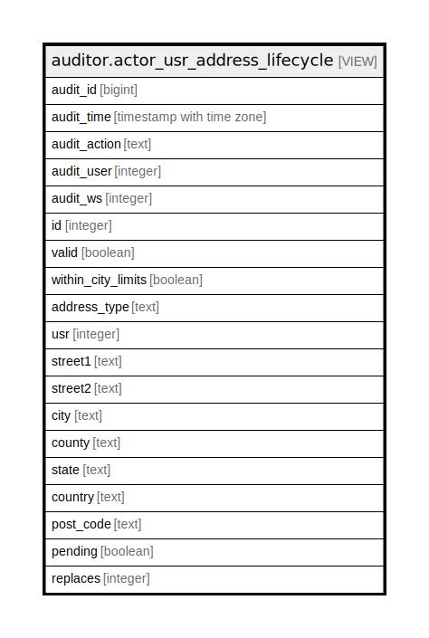

# auditor.actor_usr_address_lifecycle

## Description

<details>
<summary><strong>Table Definition</strong></summary>

```sql
CREATE VIEW actor_usr_address_lifecycle AS (
 SELECT '-1'::integer AS audit_id,
    now() AS audit_time,
    '-'::text AS audit_action,
    '-1'::integer AS audit_user,
    '-1'::integer AS audit_ws,
    usr_address.id,
    usr_address.valid,
    usr_address.within_city_limits,
    usr_address.address_type,
    usr_address.usr,
    usr_address.street1,
    usr_address.street2,
    usr_address.city,
    usr_address.county,
    usr_address.state,
    usr_address.country,
    usr_address.post_code,
    usr_address.pending,
    usr_address.replaces
   FROM actor.usr_address
UNION ALL
 SELECT actor_usr_address_history.audit_id,
    actor_usr_address_history.audit_time,
    actor_usr_address_history.audit_action,
    actor_usr_address_history.audit_user,
    actor_usr_address_history.audit_ws,
    actor_usr_address_history.id,
    actor_usr_address_history.valid,
    actor_usr_address_history.within_city_limits,
    actor_usr_address_history.address_type,
    actor_usr_address_history.usr,
    actor_usr_address_history.street1,
    actor_usr_address_history.street2,
    actor_usr_address_history.city,
    actor_usr_address_history.county,
    actor_usr_address_history.state,
    actor_usr_address_history.country,
    actor_usr_address_history.post_code,
    actor_usr_address_history.pending,
    actor_usr_address_history.replaces
   FROM auditor.actor_usr_address_history
)
```

</details>

## Columns

| Name | Type | Default | Nullable | Children | Parents | Comment |
| ---- | ---- | ------- | -------- | -------- | ------- | ------- |
| audit_id | bigint |  | true |  |  |  |
| audit_time | timestamp with time zone |  | true |  |  |  |
| audit_action | text |  | true |  |  |  |
| audit_user | integer |  | true |  |  |  |
| audit_ws | integer |  | true |  |  |  |
| id | integer |  | true |  |  |  |
| valid | boolean |  | true |  |  |  |
| within_city_limits | boolean |  | true |  |  |  |
| address_type | text |  | true |  |  |  |
| usr | integer |  | true |  |  |  |
| street1 | text |  | true |  |  |  |
| street2 | text |  | true |  |  |  |
| city | text |  | true |  |  |  |
| county | text |  | true |  |  |  |
| state | text |  | true |  |  |  |
| country | text |  | true |  |  |  |
| post_code | text |  | true |  |  |  |
| pending | boolean |  | true |  |  |  |
| replaces | integer |  | true |  |  |  |

## Referenced Tables

| Name | Columns | Comment | Type |
| ---- | ------- | ------- | ---- |
| [actor.usr_address](actor.usr_address.md) | 14 |  | BASE TABLE |
| [auditor.actor_usr_address_history](auditor.actor_usr_address_history.md) | 19 |  | BASE TABLE |

## Relations



---

> Generated by [tbls](https://github.com/k1LoW/tbls)
