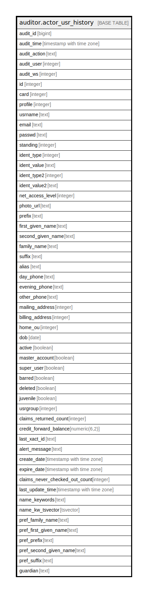

# auditor.actor_usr_history

## Description

## Columns

| Name | Type | Default | Nullable | Children | Parents | Comment |
| ---- | ---- | ------- | -------- | -------- | ------- | ------- |
| audit_id | bigint |  | false |  |  |  |
| audit_time | timestamp with time zone |  | false |  |  |  |
| audit_action | text |  | false |  |  |  |
| audit_user | integer |  | true |  |  |  |
| audit_ws | integer |  | true |  |  |  |
| id | integer |  | false |  |  |  |
| card | integer |  | true |  |  |  |
| profile | integer |  | false |  |  |  |
| usrname | text |  | false |  |  |  |
| email | text |  | true |  |  |  |
| passwd | text |  | false |  |  |  |
| standing | integer |  | false |  |  |  |
| ident_type | integer |  | false |  |  |  |
| ident_value | text |  | true |  |  |  |
| ident_type2 | integer |  | true |  |  |  |
| ident_value2 | text |  | true |  |  |  |
| net_access_level | integer |  | false |  |  |  |
| photo_url | text |  | true |  |  |  |
| prefix | text |  | true |  |  |  |
| first_given_name | text |  | false |  |  |  |
| second_given_name | text |  | true |  |  |  |
| family_name | text |  | false |  |  |  |
| suffix | text |  | true |  |  |  |
| alias | text |  | true |  |  |  |
| day_phone | text |  | true |  |  |  |
| evening_phone | text |  | true |  |  |  |
| other_phone | text |  | true |  |  |  |
| mailing_address | integer |  | true |  |  |  |
| billing_address | integer |  | true |  |  |  |
| home_ou | integer |  | false |  |  |  |
| dob | date |  | true |  |  |  |
| active | boolean |  | false |  |  |  |
| master_account | boolean |  | false |  |  |  |
| super_user | boolean |  | false |  |  |  |
| barred | boolean |  | false |  |  |  |
| deleted | boolean |  | false |  |  |  |
| juvenile | boolean |  | false |  |  |  |
| usrgroup | integer |  | false |  |  |  |
| claims_returned_count | integer |  | false |  |  |  |
| credit_forward_balance | numeric(6,2) |  | false |  |  |  |
| last_xact_id | text |  | false |  |  |  |
| alert_message | text |  | true |  |  |  |
| create_date | timestamp with time zone |  | false |  |  |  |
| expire_date | timestamp with time zone |  | false |  |  |  |
| claims_never_checked_out_count | integer |  | false |  |  |  |
| last_update_time | timestamp with time zone |  | true |  |  |  |
| name_keywords | text |  | true |  |  |  |
| name_kw_tsvector | tsvector |  | true |  |  |  |
| pref_family_name | text |  | true |  |  |  |
| pref_first_given_name | text |  | true |  |  |  |
| pref_prefix | text |  | true |  |  |  |
| pref_second_given_name | text |  | true |  |  |  |
| pref_suffix | text |  | true |  |  |  |
| guardian | text |  | true |  |  |  |

## Constraints

| Name | Type | Definition |
| ---- | ---- | ---------- |
| actor_usr_history_pkey | PRIMARY KEY | PRIMARY KEY (audit_id) |

## Indexes

| Name | Definition |
| ---- | ---------- |
| actor_usr_history_pkey | CREATE UNIQUE INDEX actor_usr_history_pkey ON auditor.actor_usr_history USING btree (audit_id) |
| aud_actor_usr_hist_id_idx | CREATE INDEX aud_actor_usr_hist_id_idx ON auditor.actor_usr_history USING btree (id) |

## Relations

---

> Generated by [tbls](https://github.com/k1LoW/tbls)
