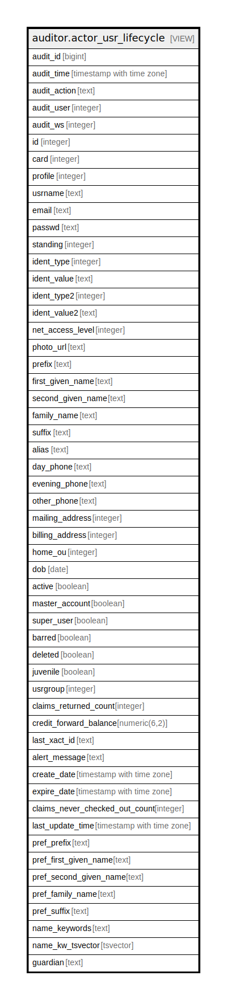

# auditor.actor_usr_lifecycle

## Description

<details>
<summary><strong>Table Definition</strong></summary>

```sql
CREATE VIEW actor_usr_lifecycle AS (
 SELECT '-1'::integer AS audit_id,
    now() AS audit_time,
    '-'::text AS audit_action,
    '-1'::integer AS audit_user,
    '-1'::integer AS audit_ws,
    usr.id,
    usr.card,
    usr.profile,
    usr.usrname,
    usr.email,
    usr.passwd,
    usr.standing,
    usr.ident_type,
    usr.ident_value,
    usr.ident_type2,
    usr.ident_value2,
    usr.net_access_level,
    usr.photo_url,
    usr.prefix,
    usr.first_given_name,
    usr.second_given_name,
    usr.family_name,
    usr.suffix,
    usr.alias,
    usr.day_phone,
    usr.evening_phone,
    usr.other_phone,
    usr.mailing_address,
    usr.billing_address,
    usr.home_ou,
    usr.dob,
    usr.active,
    usr.master_account,
    usr.super_user,
    usr.barred,
    usr.deleted,
    usr.juvenile,
    usr.usrgroup,
    usr.claims_returned_count,
    usr.credit_forward_balance,
    usr.last_xact_id,
    usr.alert_message,
    usr.create_date,
    usr.expire_date,
    usr.claims_never_checked_out_count,
    usr.last_update_time,
    usr.pref_prefix,
    usr.pref_first_given_name,
    usr.pref_second_given_name,
    usr.pref_family_name,
    usr.pref_suffix,
    usr.name_keywords,
    usr.name_kw_tsvector,
    usr.guardian
   FROM actor.usr
UNION ALL
 SELECT actor_usr_history.audit_id,
    actor_usr_history.audit_time,
    actor_usr_history.audit_action,
    actor_usr_history.audit_user,
    actor_usr_history.audit_ws,
    actor_usr_history.id,
    actor_usr_history.card,
    actor_usr_history.profile,
    actor_usr_history.usrname,
    actor_usr_history.email,
    actor_usr_history.passwd,
    actor_usr_history.standing,
    actor_usr_history.ident_type,
    actor_usr_history.ident_value,
    actor_usr_history.ident_type2,
    actor_usr_history.ident_value2,
    actor_usr_history.net_access_level,
    actor_usr_history.photo_url,
    actor_usr_history.prefix,
    actor_usr_history.first_given_name,
    actor_usr_history.second_given_name,
    actor_usr_history.family_name,
    actor_usr_history.suffix,
    actor_usr_history.alias,
    actor_usr_history.day_phone,
    actor_usr_history.evening_phone,
    actor_usr_history.other_phone,
    actor_usr_history.mailing_address,
    actor_usr_history.billing_address,
    actor_usr_history.home_ou,
    actor_usr_history.dob,
    actor_usr_history.active,
    actor_usr_history.master_account,
    actor_usr_history.super_user,
    actor_usr_history.barred,
    actor_usr_history.deleted,
    actor_usr_history.juvenile,
    actor_usr_history.usrgroup,
    actor_usr_history.claims_returned_count,
    actor_usr_history.credit_forward_balance,
    actor_usr_history.last_xact_id,
    actor_usr_history.alert_message,
    actor_usr_history.create_date,
    actor_usr_history.expire_date,
    actor_usr_history.claims_never_checked_out_count,
    actor_usr_history.last_update_time,
    actor_usr_history.pref_prefix,
    actor_usr_history.pref_first_given_name,
    actor_usr_history.pref_second_given_name,
    actor_usr_history.pref_family_name,
    actor_usr_history.pref_suffix,
    actor_usr_history.name_keywords,
    actor_usr_history.name_kw_tsvector,
    actor_usr_history.guardian
   FROM auditor.actor_usr_history
)
```

</details>

## Columns

| Name | Type | Default | Nullable | Children | Parents | Comment |
| ---- | ---- | ------- | -------- | -------- | ------- | ------- |
| audit_id | bigint |  | true |  |  |  |
| audit_time | timestamp with time zone |  | true |  |  |  |
| audit_action | text |  | true |  |  |  |
| audit_user | integer |  | true |  |  |  |
| audit_ws | integer |  | true |  |  |  |
| id | integer |  | true |  |  |  |
| card | integer |  | true |  |  |  |
| profile | integer |  | true |  |  |  |
| usrname | text |  | true |  |  |  |
| email | text |  | true |  |  |  |
| passwd | text |  | true |  |  |  |
| standing | integer |  | true |  |  |  |
| ident_type | integer |  | true |  |  |  |
| ident_value | text |  | true |  |  |  |
| ident_type2 | integer |  | true |  |  |  |
| ident_value2 | text |  | true |  |  |  |
| net_access_level | integer |  | true |  |  |  |
| photo_url | text |  | true |  |  |  |
| prefix | text |  | true |  |  |  |
| first_given_name | text |  | true |  |  |  |
| second_given_name | text |  | true |  |  |  |
| family_name | text |  | true |  |  |  |
| suffix | text |  | true |  |  |  |
| alias | text |  | true |  |  |  |
| day_phone | text |  | true |  |  |  |
| evening_phone | text |  | true |  |  |  |
| other_phone | text |  | true |  |  |  |
| mailing_address | integer |  | true |  |  |  |
| billing_address | integer |  | true |  |  |  |
| home_ou | integer |  | true |  |  |  |
| dob | date |  | true |  |  |  |
| active | boolean |  | true |  |  |  |
| master_account | boolean |  | true |  |  |  |
| super_user | boolean |  | true |  |  |  |
| barred | boolean |  | true |  |  |  |
| deleted | boolean |  | true |  |  |  |
| juvenile | boolean |  | true |  |  |  |
| usrgroup | integer |  | true |  |  |  |
| claims_returned_count | integer |  | true |  |  |  |
| credit_forward_balance | numeric(6,2) |  | true |  |  |  |
| last_xact_id | text |  | true |  |  |  |
| alert_message | text |  | true |  |  |  |
| create_date | timestamp with time zone |  | true |  |  |  |
| expire_date | timestamp with time zone |  | true |  |  |  |
| claims_never_checked_out_count | integer |  | true |  |  |  |
| last_update_time | timestamp with time zone |  | true |  |  |  |
| pref_prefix | text |  | true |  |  |  |
| pref_first_given_name | text |  | true |  |  |  |
| pref_second_given_name | text |  | true |  |  |  |
| pref_family_name | text |  | true |  |  |  |
| pref_suffix | text |  | true |  |  |  |
| name_keywords | text |  | true |  |  |  |
| name_kw_tsvector | tsvector |  | true |  |  |  |
| guardian | text |  | true |  |  |  |

## Referenced Tables

| Name | Columns | Comment | Type |
| ---- | ------- | ------- | ---- |
| [actor.usr](actor.usr.md) | 49 | <br>User objects<br><br>This table contains the core User objects that describe both<br>staff members and patrons.  The difference between the two<br>types of users is based on the user's permissions.<br> | BASE TABLE |
| [auditor.actor_usr_history](auditor.actor_usr_history.md) | 54 |  | BASE TABLE |

## Relations



---

> Generated by [tbls](https://github.com/k1LoW/tbls)
