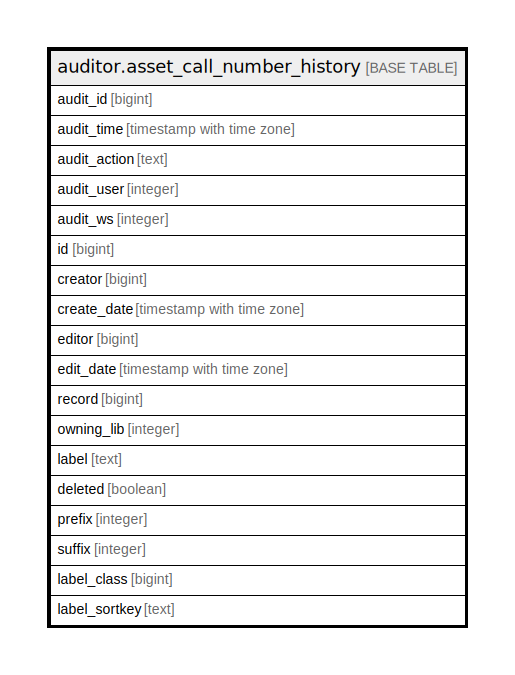

# auditor.asset_call_number_history

## Description

## Columns

| Name | Type | Default | Nullable | Children | Parents | Comment |
| ---- | ---- | ------- | -------- | -------- | ------- | ------- |
| audit_id | bigint |  | false |  |  |  |
| audit_time | timestamp with time zone |  | false |  |  |  |
| audit_action | text |  | false |  |  |  |
| audit_user | integer |  | true |  |  |  |
| audit_ws | integer |  | true |  |  |  |
| id | bigint |  | false |  |  |  |
| creator | bigint |  | false |  |  |  |
| create_date | timestamp with time zone |  | true |  |  |  |
| editor | bigint |  | false |  |  |  |
| edit_date | timestamp with time zone |  | true |  |  |  |
| record | bigint |  | false |  |  |  |
| owning_lib | integer |  | false |  |  |  |
| label | text |  | false |  |  |  |
| deleted | boolean |  | false |  |  |  |
| prefix | integer |  | false |  |  |  |
| suffix | integer |  | false |  |  |  |
| label_class | bigint |  | false |  |  |  |
| label_sortkey | text |  | true |  |  |  |

## Constraints

| Name | Type | Definition |
| ---- | ---- | ---------- |
| asset_call_number_history_pkey | PRIMARY KEY | PRIMARY KEY (audit_id) |

## Indexes

| Name | Definition |
| ---- | ---------- |
| asset_call_number_history_pkey | CREATE UNIQUE INDEX asset_call_number_history_pkey ON auditor.asset_call_number_history USING btree (audit_id) |
| aud_asset_cn_hist_creator_idx | CREATE INDEX aud_asset_cn_hist_creator_idx ON auditor.asset_call_number_history USING btree (creator) |
| aud_asset_cn_hist_editor_idx | CREATE INDEX aud_asset_cn_hist_editor_idx ON auditor.asset_call_number_history USING btree (editor) |

## Relations

---

> Generated by [tbls](https://github.com/k1LoW/tbls)
