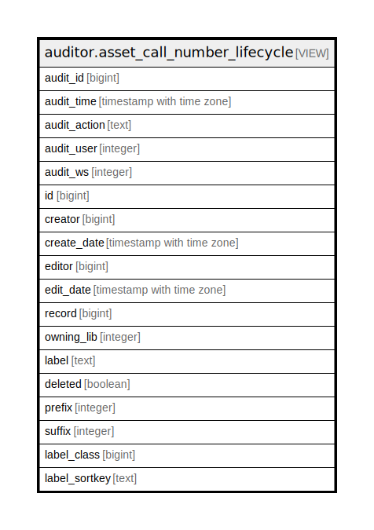

# auditor.asset_call_number_lifecycle

## Description

<details>
<summary><strong>Table Definition</strong></summary>

```sql
CREATE VIEW asset_call_number_lifecycle AS (
 SELECT '-1'::integer AS audit_id,
    now() AS audit_time,
    '-'::text AS audit_action,
    '-1'::integer AS audit_user,
    '-1'::integer AS audit_ws,
    call_number.id,
    call_number.creator,
    call_number.create_date,
    call_number.editor,
    call_number.edit_date,
    call_number.record,
    call_number.owning_lib,
    call_number.label,
    call_number.deleted,
    call_number.prefix,
    call_number.suffix,
    call_number.label_class,
    call_number.label_sortkey
   FROM asset.call_number
UNION ALL
 SELECT asset_call_number_history.audit_id,
    asset_call_number_history.audit_time,
    asset_call_number_history.audit_action,
    asset_call_number_history.audit_user,
    asset_call_number_history.audit_ws,
    asset_call_number_history.id,
    asset_call_number_history.creator,
    asset_call_number_history.create_date,
    asset_call_number_history.editor,
    asset_call_number_history.edit_date,
    asset_call_number_history.record,
    asset_call_number_history.owning_lib,
    asset_call_number_history.label,
    asset_call_number_history.deleted,
    asset_call_number_history.prefix,
    asset_call_number_history.suffix,
    asset_call_number_history.label_class,
    asset_call_number_history.label_sortkey
   FROM auditor.asset_call_number_history
)
```

</details>

## Columns

| Name | Type | Default | Nullable | Children | Parents | Comment |
| ---- | ---- | ------- | -------- | -------- | ------- | ------- |
| audit_id | bigint |  | true |  |  |  |
| audit_time | timestamp with time zone |  | true |  |  |  |
| audit_action | text |  | true |  |  |  |
| audit_user | integer |  | true |  |  |  |
| audit_ws | integer |  | true |  |  |  |
| id | bigint |  | true |  |  |  |
| creator | bigint |  | true |  |  |  |
| create_date | timestamp with time zone |  | true |  |  |  |
| editor | bigint |  | true |  |  |  |
| edit_date | timestamp with time zone |  | true |  |  |  |
| record | bigint |  | true |  |  |  |
| owning_lib | integer |  | true |  |  |  |
| label | text |  | true |  |  |  |
| deleted | boolean |  | true |  |  |  |
| prefix | integer |  | true |  |  |  |
| suffix | integer |  | true |  |  |  |
| label_class | bigint |  | true |  |  |  |
| label_sortkey | text |  | true |  |  |  |

## Referenced Tables

| Name | Columns | Comment | Type |
| ---- | ------- | ------- | ---- |
| [asset.call_number](asset.call_number.md) | 13 |  | BASE TABLE |
| [auditor.asset_call_number_history](auditor.asset_call_number_history.md) | 18 |  | BASE TABLE |

## Relations



---

> Generated by [tbls](https://github.com/k1LoW/tbls)
