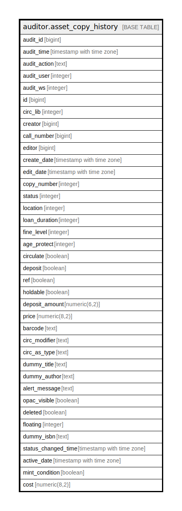

# auditor.asset_copy_history

## Description

## Columns

| Name | Type | Default | Nullable | Children | Parents | Comment |
| ---- | ---- | ------- | -------- | -------- | ------- | ------- |
| audit_id | bigint |  | false |  |  |  |
| audit_time | timestamp with time zone |  | false |  |  |  |
| audit_action | text |  | false |  |  |  |
| audit_user | integer |  | true |  |  |  |
| audit_ws | integer |  | true |  |  |  |
| id | bigint |  | false |  |  |  |
| circ_lib | integer |  | false |  |  |  |
| creator | bigint |  | false |  |  |  |
| call_number | bigint |  | false |  |  |  |
| editor | bigint |  | false |  |  |  |
| create_date | timestamp with time zone |  | true |  |  |  |
| edit_date | timestamp with time zone |  | true |  |  |  |
| copy_number | integer |  | true |  |  |  |
| status | integer |  | false |  |  |  |
| location | integer |  | false |  |  |  |
| loan_duration | integer |  | false |  |  |  |
| fine_level | integer |  | false |  |  |  |
| age_protect | integer |  | true |  |  |  |
| circulate | boolean |  | false |  |  |  |
| deposit | boolean |  | false |  |  |  |
| ref | boolean |  | false |  |  |  |
| holdable | boolean |  | false |  |  |  |
| deposit_amount | numeric(6,2) |  | false |  |  |  |
| price | numeric(8,2) |  | true |  |  |  |
| barcode | text |  | false |  |  |  |
| circ_modifier | text |  | true |  |  |  |
| circ_as_type | text |  | true |  |  |  |
| dummy_title | text |  | true |  |  |  |
| dummy_author | text |  | true |  |  |  |
| alert_message | text |  | true |  |  |  |
| opac_visible | boolean |  | false |  |  |  |
| deleted | boolean |  | false |  |  |  |
| floating | integer |  | true |  |  |  |
| dummy_isbn | text |  | true |  |  |  |
| status_changed_time | timestamp with time zone |  | true |  |  |  |
| active_date | timestamp with time zone |  | true |  |  |  |
| mint_condition | boolean |  | false |  |  |  |
| cost | numeric(8,2) |  | true |  |  |  |

## Constraints

| Name | Type | Definition |
| ---- | ---- | ---------- |
| asset_copy_history_pkey | PRIMARY KEY | PRIMARY KEY (audit_id) |

## Indexes

| Name | Definition |
| ---- | ---------- |
| asset_copy_history_pkey | CREATE UNIQUE INDEX asset_copy_history_pkey ON auditor.asset_copy_history USING btree (audit_id) |
| aud_asset_cp_hist_creator_idx | CREATE INDEX aud_asset_cp_hist_creator_idx ON auditor.asset_copy_history USING btree (creator) |
| aud_asset_cp_hist_editor_idx | CREATE INDEX aud_asset_cp_hist_editor_idx ON auditor.asset_copy_history USING btree (editor) |

## Relations

---

> Generated by [tbls](https://github.com/k1LoW/tbls)
