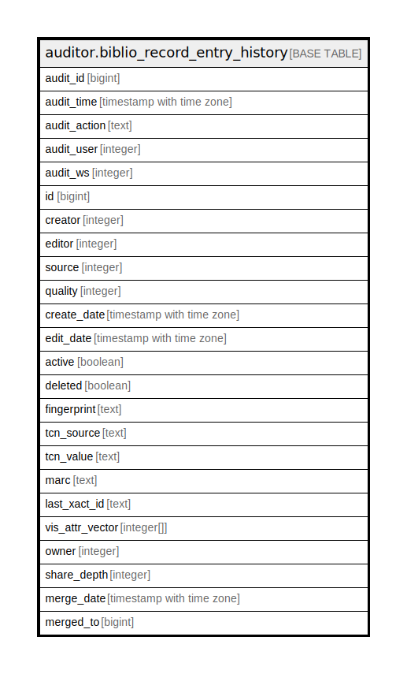

# auditor.biblio_record_entry_history

## Description

## Columns

| Name | Type | Default | Nullable | Children | Parents | Comment |
| ---- | ---- | ------- | -------- | -------- | ------- | ------- |
| audit_id | bigint |  | false |  |  |  |
| audit_time | timestamp with time zone |  | false |  |  |  |
| audit_action | text |  | false |  |  |  |
| audit_user | integer |  | true |  |  |  |
| audit_ws | integer |  | true |  |  |  |
| id | bigint |  | false |  |  |  |
| creator | integer |  | false |  |  |  |
| editor | integer |  | false |  |  |  |
| source | integer |  | true |  |  |  |
| quality | integer |  | true |  |  |  |
| create_date | timestamp with time zone |  | false |  |  |  |
| edit_date | timestamp with time zone |  | false |  |  |  |
| active | boolean |  | false |  |  |  |
| deleted | boolean |  | false |  |  |  |
| fingerprint | text |  | true |  |  |  |
| tcn_source | text |  | false |  |  |  |
| tcn_value | text |  | false |  |  |  |
| marc | text |  | false |  |  |  |
| last_xact_id | text |  | false |  |  |  |
| vis_attr_vector | integer[] |  | true |  |  |  |
| owner | integer |  | true |  |  |  |
| share_depth | integer |  | true |  |  |  |
| merge_date | timestamp with time zone |  | true |  |  |  |
| merged_to | bigint |  | true |  |  |  |

## Constraints

| Name | Type | Definition |
| ---- | ---- | ---------- |
| biblio_record_entry_history_pkey | PRIMARY KEY | PRIMARY KEY (audit_id) |

## Indexes

| Name | Definition |
| ---- | ---------- |
| biblio_record_entry_history_pkey | CREATE UNIQUE INDEX biblio_record_entry_history_pkey ON auditor.biblio_record_entry_history USING btree (audit_id) |
| aud_bib_rec_entry_hist_creator_idx | CREATE INDEX aud_bib_rec_entry_hist_creator_idx ON auditor.biblio_record_entry_history USING btree (creator) |
| aud_bib_rec_entry_hist_editor_idx | CREATE INDEX aud_bib_rec_entry_hist_editor_idx ON auditor.biblio_record_entry_history USING btree (editor) |

## Relations

---

> Generated by [tbls](https://github.com/k1LoW/tbls)
