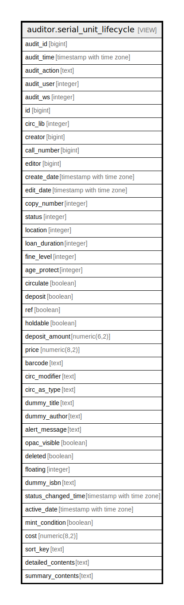

# auditor.serial_unit_lifecycle

## Description

<details>
<summary><strong>Table Definition</strong></summary>

```sql
CREATE VIEW serial_unit_lifecycle AS (
 SELECT '-1'::integer AS audit_id,
    now() AS audit_time,
    '-'::text AS audit_action,
    '-1'::integer AS audit_user,
    '-1'::integer AS audit_ws,
    unit.id,
    unit.circ_lib,
    unit.creator,
    unit.call_number,
    unit.editor,
    unit.create_date,
    unit.edit_date,
    unit.copy_number,
    unit.status,
    unit.location,
    unit.loan_duration,
    unit.fine_level,
    unit.age_protect,
    unit.circulate,
    unit.deposit,
    unit.ref,
    unit.holdable,
    unit.deposit_amount,
    unit.price,
    unit.barcode,
    unit.circ_modifier,
    unit.circ_as_type,
    unit.dummy_title,
    unit.dummy_author,
    unit.alert_message,
    unit.opac_visible,
    unit.deleted,
    unit.floating,
    unit.dummy_isbn,
    unit.status_changed_time,
    unit.active_date,
    unit.mint_condition,
    unit.cost,
    unit.sort_key,
    unit.detailed_contents,
    unit.summary_contents
   FROM serial.unit
UNION ALL
 SELECT serial_unit_history.audit_id,
    serial_unit_history.audit_time,
    serial_unit_history.audit_action,
    serial_unit_history.audit_user,
    serial_unit_history.audit_ws,
    serial_unit_history.id,
    serial_unit_history.circ_lib,
    serial_unit_history.creator,
    serial_unit_history.call_number,
    serial_unit_history.editor,
    serial_unit_history.create_date,
    serial_unit_history.edit_date,
    serial_unit_history.copy_number,
    serial_unit_history.status,
    serial_unit_history.location,
    serial_unit_history.loan_duration,
    serial_unit_history.fine_level,
    serial_unit_history.age_protect,
    serial_unit_history.circulate,
    serial_unit_history.deposit,
    serial_unit_history.ref,
    serial_unit_history.holdable,
    serial_unit_history.deposit_amount,
    serial_unit_history.price,
    serial_unit_history.barcode,
    serial_unit_history.circ_modifier,
    serial_unit_history.circ_as_type,
    serial_unit_history.dummy_title,
    serial_unit_history.dummy_author,
    serial_unit_history.alert_message,
    serial_unit_history.opac_visible,
    serial_unit_history.deleted,
    serial_unit_history.floating,
    serial_unit_history.dummy_isbn,
    serial_unit_history.status_changed_time,
    serial_unit_history.active_date,
    serial_unit_history.mint_condition,
    serial_unit_history.cost,
    serial_unit_history.sort_key,
    serial_unit_history.detailed_contents,
    serial_unit_history.summary_contents
   FROM auditor.serial_unit_history
)
```

</details>

## Columns

| Name | Type | Default | Nullable | Children | Parents | Comment |
| ---- | ---- | ------- | -------- | -------- | ------- | ------- |
| audit_id | bigint |  | true |  |  |  |
| audit_time | timestamp with time zone |  | true |  |  |  |
| audit_action | text |  | true |  |  |  |
| audit_user | integer |  | true |  |  |  |
| audit_ws | integer |  | true |  |  |  |
| id | bigint |  | true |  |  |  |
| circ_lib | integer |  | true |  |  |  |
| creator | bigint |  | true |  |  |  |
| call_number | bigint |  | true |  |  |  |
| editor | bigint |  | true |  |  |  |
| create_date | timestamp with time zone |  | true |  |  |  |
| edit_date | timestamp with time zone |  | true |  |  |  |
| copy_number | integer |  | true |  |  |  |
| status | integer |  | true |  |  |  |
| location | integer |  | true |  |  |  |
| loan_duration | integer |  | true |  |  |  |
| fine_level | integer |  | true |  |  |  |
| age_protect | integer |  | true |  |  |  |
| circulate | boolean |  | true |  |  |  |
| deposit | boolean |  | true |  |  |  |
| ref | boolean |  | true |  |  |  |
| holdable | boolean |  | true |  |  |  |
| deposit_amount | numeric(6,2) |  | true |  |  |  |
| price | numeric(8,2) |  | true |  |  |  |
| barcode | text |  | true |  |  |  |
| circ_modifier | text |  | true |  |  |  |
| circ_as_type | text |  | true |  |  |  |
| dummy_title | text |  | true |  |  |  |
| dummy_author | text |  | true |  |  |  |
| alert_message | text |  | true |  |  |  |
| opac_visible | boolean |  | true |  |  |  |
| deleted | boolean |  | true |  |  |  |
| floating | integer |  | true |  |  |  |
| dummy_isbn | text |  | true |  |  |  |
| status_changed_time | timestamp with time zone |  | true |  |  |  |
| active_date | timestamp with time zone |  | true |  |  |  |
| mint_condition | boolean |  | true |  |  |  |
| cost | numeric(8,2) |  | true |  |  |  |
| sort_key | text |  | true |  |  |  |
| detailed_contents | text |  | true |  |  |  |
| summary_contents | text |  | true |  |  |  |

## Referenced Tables

| Name | Columns | Comment | Type |
| ---- | ------- | ------- | ---- |
| [serial.unit](serial.unit.md) | 36 |  | BASE TABLE |
| [auditor.serial_unit_history](auditor.serial_unit_history.md) | 41 |  | BASE TABLE |

## Relations



---

> Generated by [tbls](https://github.com/k1LoW/tbls)
