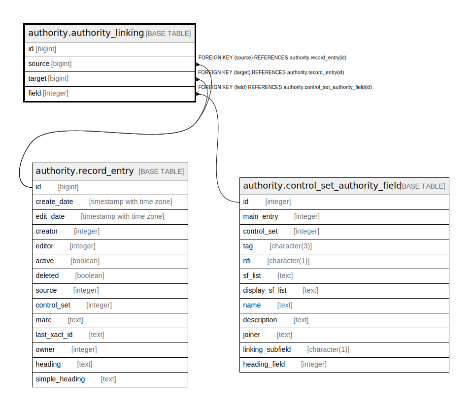

# authority.authority_linking

## Description

## Columns

| Name | Type | Default | Nullable | Children | Parents | Comment |
| ---- | ---- | ------- | -------- | -------- | ------- | ------- |
| id | bigint | nextval('authority.authority_linking_id_seq'::regclass) | false |  |  |  |
| source | bigint |  | false |  | [authority.record_entry](authority.record_entry.md) |  |
| target | bigint |  | false |  | [authority.record_entry](authority.record_entry.md) |  |
| field | integer |  | false |  | [authority.control_set_authority_field](authority.control_set_authority_field.md) |  |

## Constraints

| Name | Type | Definition |
| ---- | ---- | ---------- |
| authority_linking_pkey | PRIMARY KEY | PRIMARY KEY (id) |
| authority_linking_field_fkey | FOREIGN KEY | FOREIGN KEY (field) REFERENCES authority.control_set_authority_field(id) |
| authority_linking_source_fkey | FOREIGN KEY | FOREIGN KEY (source) REFERENCES authority.record_entry(id) |
| authority_linking_target_fkey | FOREIGN KEY | FOREIGN KEY (target) REFERENCES authority.record_entry(id) |

## Indexes

| Name | Definition |
| ---- | ---------- |
| authority_linking_pkey | CREATE UNIQUE INDEX authority_linking_pkey ON authority.authority_linking USING btree (id) |

## Relations

---

> Generated by [tbls](https://github.com/k1LoW/tbls)
