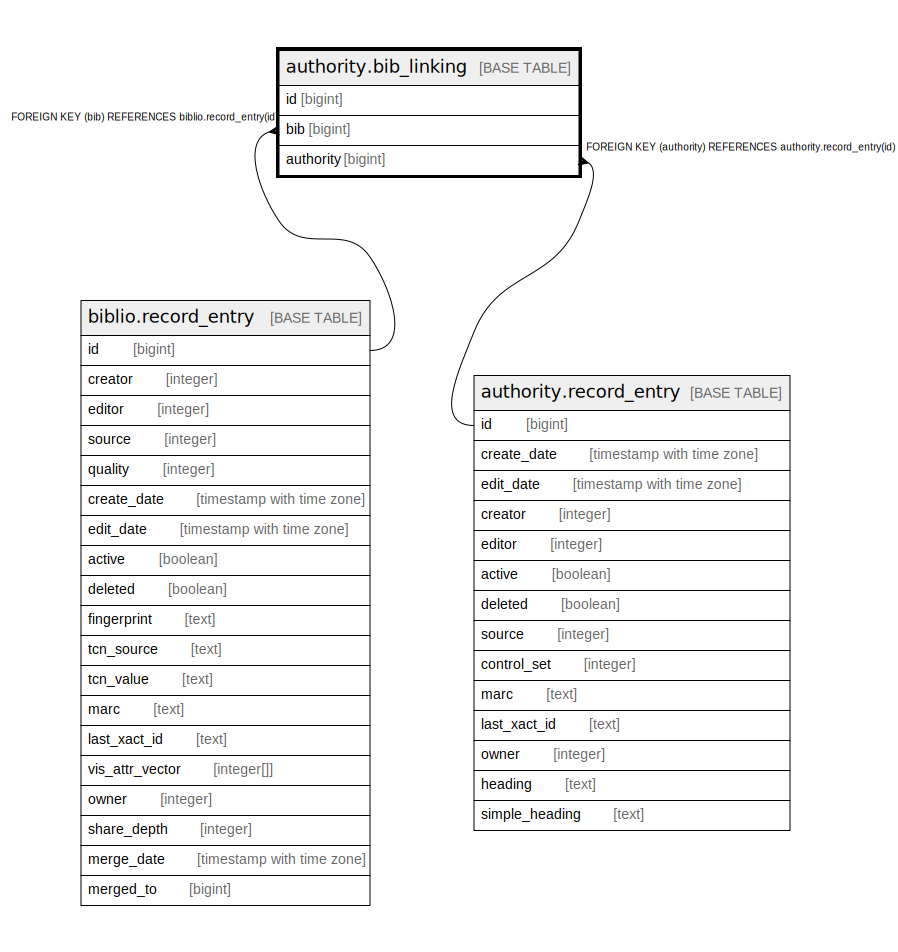

# authority.bib_linking

## Description

## Columns

| Name | Type | Default | Nullable | Children | Parents | Comment |
| ---- | ---- | ------- | -------- | -------- | ------- | ------- |
| id | bigint | nextval('authority.bib_linking_id_seq'::regclass) | false |  |  |  |
| bib | bigint |  | false |  | [biblio.record_entry](biblio.record_entry.md) |  |
| authority | bigint |  | false |  | [authority.record_entry](authority.record_entry.md) |  |

## Constraints

| Name | Type | Definition |
| ---- | ---- | ---------- |
| bib_linking_pkey | PRIMARY KEY | PRIMARY KEY (id) |
| bib_linking_authority_fkey | FOREIGN KEY | FOREIGN KEY (authority) REFERENCES authority.record_entry(id) |
| bib_linking_bib_fkey | FOREIGN KEY | FOREIGN KEY (bib) REFERENCES biblio.record_entry(id) |

## Indexes

| Name | Definition |
| ---- | ---------- |
| bib_linking_pkey | CREATE UNIQUE INDEX bib_linking_pkey ON authority.bib_linking USING btree (id) |
| authority_bl_bib_authority_once_idx | CREATE UNIQUE INDEX authority_bl_bib_authority_once_idx ON authority.bib_linking USING btree (authority, bib) |
| authority_bl_bib_idx | CREATE INDEX authority_bl_bib_idx ON authority.bib_linking USING btree (bib) |

## Relations

---

> Generated by [tbls](https://github.com/k1LoW/tbls)
