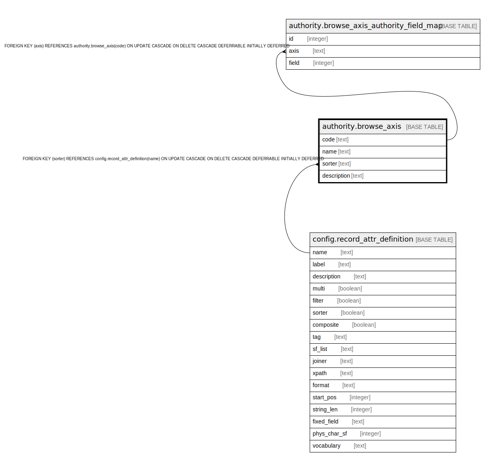

# authority.browse_axis

## Description

## Columns

| Name | Type | Default | Nullable | Children | Parents | Comment |
| ---- | ---- | ------- | -------- | -------- | ------- | ------- |
| code | text |  | false | [authority.browse_axis_authority_field_map](authority.browse_axis_authority_field_map.md) |  |  |
| name | text |  | false |  |  |  |
| sorter | text |  | true |  | [config.record_attr_definition](config.record_attr_definition.md) |  |
| description | text |  | true |  |  |  |

## Constraints

| Name | Type | Definition |
| ---- | ---- | ---------- |
| browse_axis_name_key | UNIQUE | UNIQUE (name) |
| browse_axis_pkey | PRIMARY KEY | PRIMARY KEY (code) |
| browse_axis_sorter_fkey | FOREIGN KEY | FOREIGN KEY (sorter) REFERENCES config.record_attr_definition(name) ON UPDATE CASCADE ON DELETE CASCADE DEFERRABLE INITIALLY DEFERRED |

## Indexes

| Name | Definition |
| ---- | ---------- |
| browse_axis_name_key | CREATE UNIQUE INDEX browse_axis_name_key ON authority.browse_axis USING btree (name) |
| browse_axis_pkey | CREATE UNIQUE INDEX browse_axis_pkey ON authority.browse_axis USING btree (code) |

## Relations

---

> Generated by [tbls](https://github.com/k1LoW/tbls)
