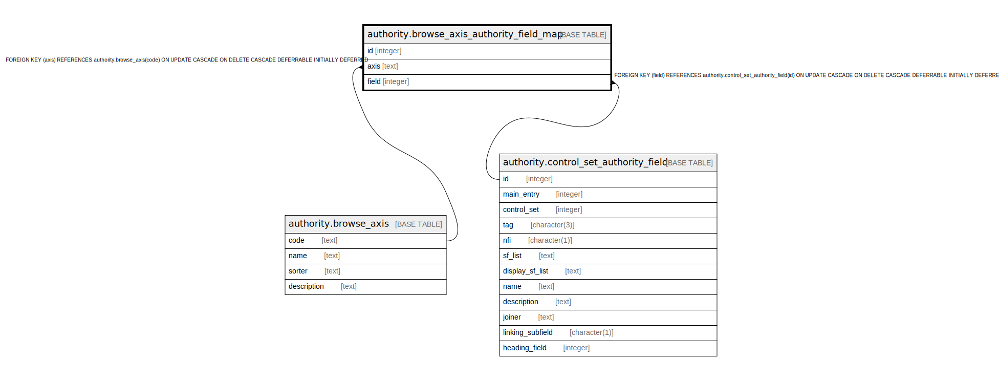

# authority.browse_axis_authority_field_map

## Description

## Columns

| Name | Type | Default | Nullable | Children | Parents | Comment |
| ---- | ---- | ------- | -------- | -------- | ------- | ------- |
| id | integer | nextval('authority.browse_axis_authority_field_map_id_seq'::regclass) | false |  |  |  |
| axis | text |  | false |  | [authority.browse_axis](authority.browse_axis.md) |  |
| field | integer |  | false |  | [authority.control_set_authority_field](authority.control_set_authority_field.md) |  |

## Constraints

| Name | Type | Definition |
| ---- | ---- | ---------- |
| browse_axis_authority_field_map_pkey | PRIMARY KEY | PRIMARY KEY (id) |
| browse_axis_authority_field_map_axis_fkey | FOREIGN KEY | FOREIGN KEY (axis) REFERENCES authority.browse_axis(code) ON UPDATE CASCADE ON DELETE CASCADE DEFERRABLE INITIALLY DEFERRED |
| browse_axis_authority_field_map_field_fkey | FOREIGN KEY | FOREIGN KEY (field) REFERENCES authority.control_set_authority_field(id) ON UPDATE CASCADE ON DELETE CASCADE DEFERRABLE INITIALLY DEFERRED |

## Indexes

| Name | Definition |
| ---- | ---------- |
| browse_axis_authority_field_map_pkey | CREATE UNIQUE INDEX browse_axis_authority_field_map_pkey ON authority.browse_axis_authority_field_map USING btree (id) |

## Relations

---

> Generated by [tbls](https://github.com/k1LoW/tbls)
