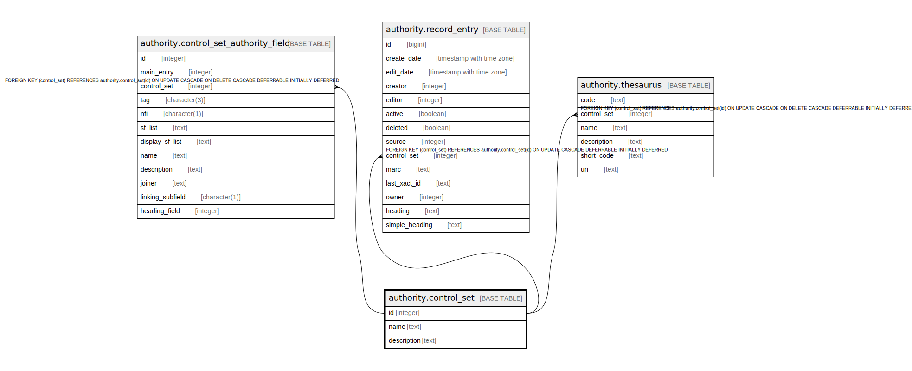

# authority.control_set

## Description

## Columns

| Name | Type | Default | Nullable | Children | Parents | Comment |
| ---- | ---- | ------- | -------- | -------- | ------- | ------- |
| id | integer | nextval('authority.control_set_id_seq'::regclass) | false | [authority.control_set_authority_field](authority.control_set_authority_field.md) [authority.record_entry](authority.record_entry.md) [authority.thesaurus](authority.thesaurus.md) |  |  |
| name | text |  | false |  |  |  |
| description | text |  | true |  |  |  |

## Constraints

| Name | Type | Definition |
| ---- | ---- | ---------- |
| control_set_name_key | UNIQUE | UNIQUE (name) |
| control_set_pkey | PRIMARY KEY | PRIMARY KEY (id) |

## Indexes

| Name | Definition |
| ---- | ---------- |
| control_set_name_key | CREATE UNIQUE INDEX control_set_name_key ON authority.control_set USING btree (name) |
| control_set_pkey | CREATE UNIQUE INDEX control_set_pkey ON authority.control_set USING btree (id) |

## Relations

---

> Generated by [tbls](https://github.com/k1LoW/tbls)
