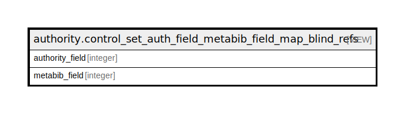

# authority.control_set_auth_field_metabib_field_map_blind_refs

## Description

metabib fields for all auth fields that can't be linked to other records

<details>
<summary><strong>Table Definition</strong></summary>

```sql
CREATE VIEW control_set_auth_field_metabib_field_map_blind_refs AS (
 SELECT r.authority_field,
    r.metabib_field
   FROM (authority.control_set_auth_field_metabib_field_map_refs r
     JOIN authority.control_set_authority_field a ON ((r.authority_field = a.id)))
  WHERE (a.linking_subfield IS NULL)
)
```

</details>

## Columns

| Name | Type | Default | Nullable | Children | Parents | Comment |
| ---- | ---- | ------- | -------- | -------- | ------- | ------- |
| authority_field | integer |  | true |  |  |  |
| metabib_field | integer |  | true |  |  |  |

## Referenced Tables

| Name | Columns | Comment | Type |
| ---- | ------- | ------- | ---- |
| [authority.control_set_auth_field_metabib_field_map_refs](authority.control_set_auth_field_metabib_field_map_refs.md) | 2 | metabib fields for all auth fields | VIEW |
| [authority.control_set_authority_field](authority.control_set_authority_field.md) | 12 |  | BASE TABLE |

## Relations



---

> Generated by [tbls](https://github.com/k1LoW/tbls)
