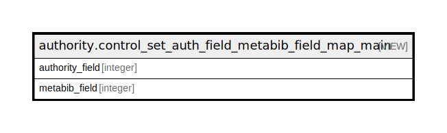

# authority.control_set_auth_field_metabib_field_map_main

## Description

metabib fields for main entry auth fields

<details>
<summary><strong>Table Definition</strong></summary>

```sql
CREATE VIEW control_set_auth_field_metabib_field_map_main AS (
 SELECT DISTINCT b.authority_field,
    m.metabib_field
   FROM (authority.control_set_bib_field_metabib_field_map m
     JOIN authority.control_set_bib_field b ON ((b.id = m.bib_field)))
)
```

</details>

## Columns

| Name | Type | Default | Nullable | Children | Parents | Comment |
| ---- | ---- | ------- | -------- | -------- | ------- | ------- |
| authority_field | integer |  | true |  |  |  |
| metabib_field | integer |  | true |  |  |  |

## Referenced Tables

| Name | Columns | Comment | Type |
| ---- | ------- | ------- | ---- |
| [authority.control_set_bib_field_metabib_field_map](authority.control_set_bib_field_metabib_field_map.md) | 3 |  | BASE TABLE |
| [authority.control_set_bib_field](authority.control_set_bib_field.md) | 3 |  | BASE TABLE |

## Relations



---

> Generated by [tbls](https://github.com/k1LoW/tbls)
