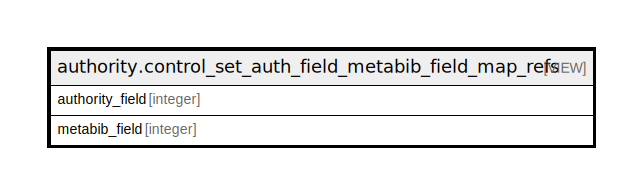

# authority.control_set_auth_field_metabib_field_map_refs

## Description

metabib fields for all auth fields

<details>
<summary><strong>Table Definition</strong></summary>

```sql
CREATE VIEW control_set_auth_field_metabib_field_map_refs AS (
 SELECT control_set_auth_field_metabib_field_map_main.authority_field,
    control_set_auth_field_metabib_field_map_main.metabib_field
   FROM authority.control_set_auth_field_metabib_field_map_main
UNION
 SELECT control_set_auth_field_metabib_field_map_refs_only.authority_field,
    control_set_auth_field_metabib_field_map_refs_only.metabib_field
   FROM authority.control_set_auth_field_metabib_field_map_refs_only
)
```

</details>

## Columns

| Name | Type | Default | Nullable | Children | Parents | Comment |
| ---- | ---- | ------- | -------- | -------- | ------- | ------- |
| authority_field | integer |  | true |  |  |  |
| metabib_field | integer |  | true |  |  |  |

## Referenced Tables

| Name | Columns | Comment | Type |
| ---- | ------- | ------- | ---- |
| [authority.control_set_auth_field_metabib_field_map_main](authority.control_set_auth_field_metabib_field_map_main.md) | 2 | metabib fields for main entry auth fields | VIEW |
| [authority.control_set_auth_field_metabib_field_map_refs_only](authority.control_set_auth_field_metabib_field_map_refs_only.md) | 2 | metabib fields for NON-main entry auth fields | VIEW |

## Relations



---

> Generated by [tbls](https://github.com/k1LoW/tbls)
