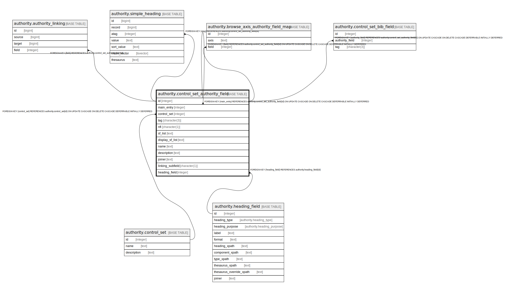

# authority.control_set_authority_field

## Description

## Columns

| Name | Type | Default | Nullable | Children | Parents | Comment |
| ---- | ---- | ------- | -------- | -------- | ------- | ------- |
| id | integer | nextval('authority.control_set_authority_field_id_seq'::regclass) | false | [authority.authority_linking](authority.authority_linking.md) [authority.simple_heading](authority.simple_heading.md) [authority.browse_axis_authority_field_map](authority.browse_axis_authority_field_map.md) [authority.control_set_bib_field](authority.control_set_bib_field.md) [authority.control_set_authority_field](authority.control_set_authority_field.md) |  |  |
| main_entry | integer |  | true |  | [authority.control_set_authority_field](authority.control_set_authority_field.md) |  |
| control_set | integer |  | false |  | [authority.control_set](authority.control_set.md) |  |
| tag | character(3) |  | false |  |  |  |
| nfi | character(1) |  | true |  |  |  |
| sf_list | text |  | false |  |  |  |
| display_sf_list | text |  | false |  |  |  |
| name | text |  | false |  |  |  |
| description | text |  | true |  |  |  |
| joiner | text |  | true |  |  |  |
| linking_subfield | character(1) |  | true |  |  |  |
| heading_field | integer |  | true |  | [authority.heading_field](authority.heading_field.md) |  |

## Constraints

| Name | Type | Definition |
| ---- | ---- | ---------- |
| control_set_authority_field_main_entry_fkey | FOREIGN KEY | FOREIGN KEY (main_entry) REFERENCES authority.control_set_authority_field(id) ON UPDATE CASCADE ON DELETE CASCADE DEFERRABLE INITIALLY DEFERRED |
| control_set_authority_field_pkey | PRIMARY KEY | PRIMARY KEY (id) |
| control_set_authority_field_control_set_fkey | FOREIGN KEY | FOREIGN KEY (control_set) REFERENCES authority.control_set(id) ON UPDATE CASCADE ON DELETE CASCADE DEFERRABLE INITIALLY DEFERRED |
| control_set_authority_field_heading_field_fkey | FOREIGN KEY | FOREIGN KEY (heading_field) REFERENCES authority.heading_field(id) |

## Indexes

| Name | Definition |
| ---- | ---------- |
| control_set_authority_field_pkey | CREATE UNIQUE INDEX control_set_authority_field_pkey ON authority.control_set_authority_field USING btree (id) |

## Relations

---

> Generated by [tbls](https://github.com/k1LoW/tbls)
