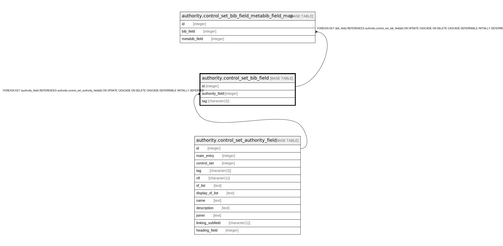

# authority.control_set_bib_field

## Description

## Columns

| Name | Type | Default | Nullable | Children | Parents | Comment |
| ---- | ---- | ------- | -------- | -------- | ------- | ------- |
| id | integer | nextval('authority.control_set_bib_field_id_seq'::regclass) | false | [authority.control_set_bib_field_metabib_field_map](authority.control_set_bib_field_metabib_field_map.md) |  |  |
| authority_field | integer |  | false |  | [authority.control_set_authority_field](authority.control_set_authority_field.md) |  |
| tag | character(3) |  | false |  |  |  |

## Constraints

| Name | Type | Definition |
| ---- | ---- | ---------- |
| control_set_bib_field_authority_field_fkey | FOREIGN KEY | FOREIGN KEY (authority_field) REFERENCES authority.control_set_authority_field(id) ON UPDATE CASCADE ON DELETE CASCADE DEFERRABLE INITIALLY DEFERRED |
| control_set_bib_field_pkey | PRIMARY KEY | PRIMARY KEY (id) |

## Indexes

| Name | Definition |
| ---- | ---------- |
| control_set_bib_field_pkey | CREATE UNIQUE INDEX control_set_bib_field_pkey ON authority.control_set_bib_field USING btree (id) |

## Relations

---

> Generated by [tbls](https://github.com/k1LoW/tbls)
