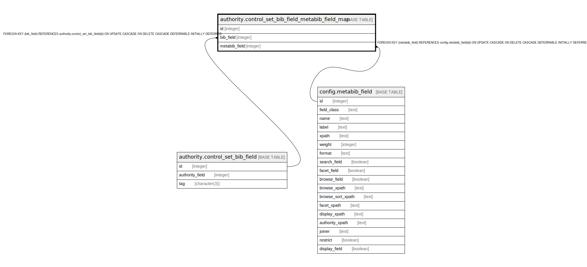

# authority.control_set_bib_field_metabib_field_map

## Description

## Columns

| Name | Type | Default | Nullable | Children | Parents | Comment |
| ---- | ---- | ------- | -------- | -------- | ------- | ------- |
| id | integer | nextval('authority.control_set_bib_field_metabib_field_map_id_seq'::regclass) | false |  |  |  |
| bib_field | integer |  | false |  | [authority.control_set_bib_field](authority.control_set_bib_field.md) |  |
| metabib_field | integer |  | false |  | [config.metabib_field](config.metabib_field.md) |  |

## Constraints

| Name | Type | Definition |
| ---- | ---- | ---------- |
| a_bf_mf_map_once | UNIQUE | UNIQUE (bib_field, metabib_field) |
| control_set_bib_field_metabib_field_map_pkey | PRIMARY KEY | PRIMARY KEY (id) |
| control_set_bib_field_metabib_field_map_bib_field_fkey | FOREIGN KEY | FOREIGN KEY (bib_field) REFERENCES authority.control_set_bib_field(id) ON UPDATE CASCADE ON DELETE CASCADE DEFERRABLE INITIALLY DEFERRED |
| control_set_bib_field_metabib_field_map_metabib_field_fkey | FOREIGN KEY | FOREIGN KEY (metabib_field) REFERENCES config.metabib_field(id) ON UPDATE CASCADE ON DELETE CASCADE DEFERRABLE INITIALLY DEFERRED |

## Indexes

| Name | Definition |
| ---- | ---------- |
| a_bf_mf_map_once | CREATE UNIQUE INDEX a_bf_mf_map_once ON authority.control_set_bib_field_metabib_field_map USING btree (bib_field, metabib_field) |
| control_set_bib_field_metabib_field_map_pkey | CREATE UNIQUE INDEX control_set_bib_field_metabib_field_map_pkey ON authority.control_set_bib_field_metabib_field_map USING btree (id) |

## Relations

---

> Generated by [tbls](https://github.com/k1LoW/tbls)
