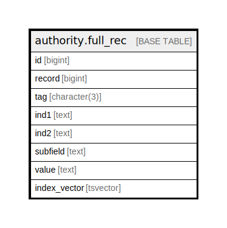

# authority.full_rec

## Description

## Columns

| Name | Type | Default | Nullable | Children | Parents | Comment |
| ---- | ---- | ------- | -------- | -------- | ------- | ------- |
| id | bigint | nextval('authority.full_rec_id_seq'::regclass) | false |  |  |  |
| record | bigint |  | false |  |  |  |
| tag | character(3) |  | false |  |  |  |
| ind1 | text |  | true |  |  |  |
| ind2 | text |  | true |  |  |  |
| subfield | text |  | true |  |  |  |
| value | text |  | false |  |  |  |
| index_vector | tsvector |  | false |  |  |  |

## Constraints

| Name | Type | Definition |
| ---- | ---- | ---------- |
| full_rec_pkey | PRIMARY KEY | PRIMARY KEY (id) |

## Indexes

| Name | Definition |
| ---- | ---------- |
| full_rec_pkey | CREATE UNIQUE INDEX full_rec_pkey ON authority.full_rec USING btree (id) |
| authority_full_rec_index_vector_idx | CREATE INDEX authority_full_rec_index_vector_idx ON authority.full_rec USING gin (index_vector) |
| authority_full_rec_record_idx | CREATE INDEX authority_full_rec_record_idx ON authority.full_rec USING btree (record) |
| authority_full_rec_subfield_a_idx | CREATE INDEX authority_full_rec_subfield_a_idx ON authority.full_rec USING btree (value) WHERE (subfield = 'a'::text) |
| authority_full_rec_tag_part_idx | CREATE INDEX authority_full_rec_tag_part_idx ON authority.full_rec USING btree ("substring"((tag)::text, 2)) |
| authority_full_rec_tag_subfield_idx | CREATE INDEX authority_full_rec_tag_subfield_idx ON authority.full_rec USING btree (tag, subfield) |
| authority_full_rec_value_index | CREATE INDEX authority_full_rec_value_index ON authority.full_rec USING btree ("substring"(value, 1, 1024)) |
| authority_full_rec_value_tpo_index | CREATE INDEX authority_full_rec_value_tpo_index ON authority.full_rec USING btree ("substring"(value, 1, 1024) text_pattern_ops) |

## Triggers

| Name | Definition |
| ---- | ---------- |
| authority_full_rec_fti_trigger | CREATE TRIGGER authority_full_rec_fti_trigger BEFORE INSERT OR UPDATE ON authority.full_rec FOR EACH ROW EXECUTE PROCEDURE oils_tsearch2('keyword') |

## Relations

---

> Generated by [tbls](https://github.com/k1LoW/tbls)
