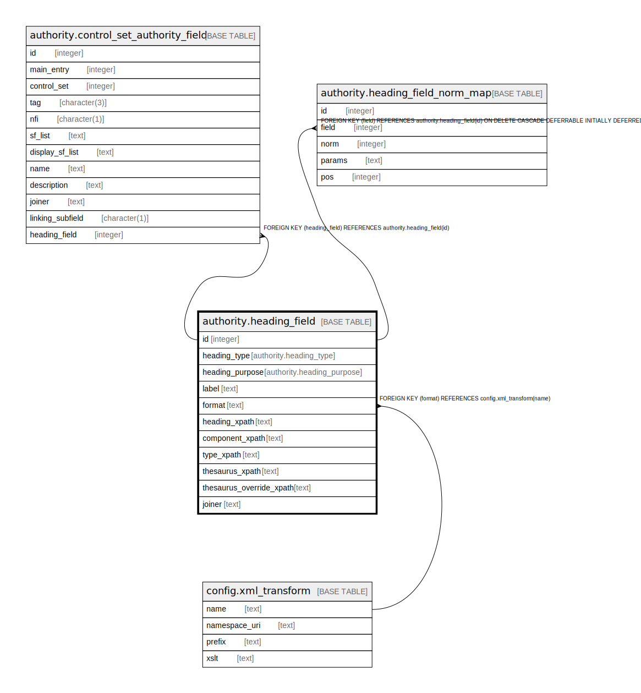

# authority.heading_field

## Description

## Columns

| Name | Type | Default | Nullable | Children | Parents | Comment |
| ---- | ---- | ------- | -------- | -------- | ------- | ------- |
| id | integer | nextval('authority.heading_field_id_seq'::regclass) | false | [authority.control_set_authority_field](authority.control_set_authority_field.md) [authority.heading_field_norm_map](authority.heading_field_norm_map.md) |  |  |
| heading_type | authority.heading_type |  | false |  |  |  |
| heading_purpose | authority.heading_purpose |  | false |  |  |  |
| label | text |  | false |  |  |  |
| format | text | 'mads21'::text | false |  | [config.xml_transform](config.xml_transform.md) |  |
| heading_xpath | text |  | false |  |  |  |
| component_xpath | text |  | false |  |  |  |
| type_xpath | text |  | true |  |  |  |
| thesaurus_xpath | text |  | true |  |  |  |
| thesaurus_override_xpath | text |  | true |  |  |  |
| joiner | text |  | true |  |  |  |

## Constraints

| Name | Type | Definition |
| ---- | ---- | ---------- |
| heading_field_pkey | PRIMARY KEY | PRIMARY KEY (id) |
| heading_field_format_fkey | FOREIGN KEY | FOREIGN KEY (format) REFERENCES config.xml_transform(name) |

## Indexes

| Name | Definition |
| ---- | ---------- |
| heading_field_pkey | CREATE UNIQUE INDEX heading_field_pkey ON authority.heading_field USING btree (id) |

## Relations

---

> Generated by [tbls](https://github.com/k1LoW/tbls)
