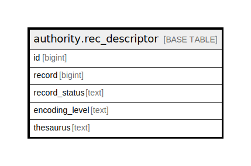

# authority.rec_descriptor

## Description

## Columns

| Name | Type | Default | Nullable | Children | Parents | Comment |
| ---- | ---- | ------- | -------- | -------- | ------- | ------- |
| id | bigint | nextval('authority.rec_descriptor_id_seq'::regclass) | false |  |  |  |
| record | bigint |  | true |  |  |  |
| record_status | text |  | true |  |  |  |
| encoding_level | text |  | true |  |  |  |
| thesaurus | text |  | true |  |  |  |

## Constraints

| Name | Type | Definition |
| ---- | ---- | ---------- |
| rec_descriptor_pkey | PRIMARY KEY | PRIMARY KEY (id) |

## Indexes

| Name | Definition |
| ---- | ---------- |
| rec_descriptor_pkey | CREATE UNIQUE INDEX rec_descriptor_pkey ON authority.rec_descriptor USING btree (id) |
| authority_rec_descriptor_record_idx | CREATE INDEX authority_rec_descriptor_record_idx ON authority.rec_descriptor USING btree (record) |

## Relations

---

> Generated by [tbls](https://github.com/k1LoW/tbls)
