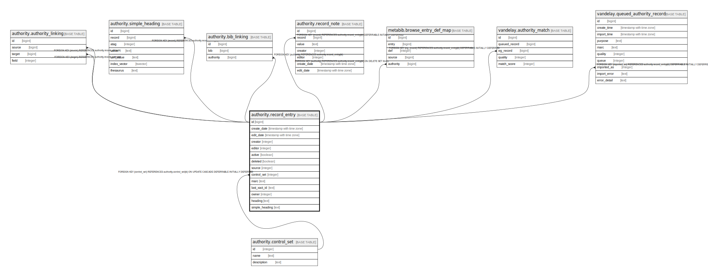

# authority.record_entry

## Description

## Columns

| Name | Type | Default | Nullable | Children | Parents | Comment |
| ---- | ---- | ------- | -------- | -------- | ------- | ------- |
| id | bigint | nextval('authority.record_entry_id_seq'::regclass) | false | [authority.authority_linking](authority.authority_linking.md) [authority.simple_heading](authority.simple_heading.md) [authority.bib_linking](authority.bib_linking.md) [authority.record_note](authority.record_note.md) [metabib.browse_entry_def_map](metabib.browse_entry_def_map.md) [vandelay.authority_match](vandelay.authority_match.md) [vandelay.queued_authority_record](vandelay.queued_authority_record.md) |  |  |
| create_date | timestamp with time zone | now() | false |  |  |  |
| edit_date | timestamp with time zone | now() | false |  |  |  |
| creator | integer | 1 | false |  |  |  |
| editor | integer | 1 | false |  |  |  |
| active | boolean | true | false |  |  |  |
| deleted | boolean | false | false |  |  |  |
| source | integer |  | true |  |  |  |
| control_set | integer |  | true |  | [authority.control_set](authority.control_set.md) |  |
| marc | text |  | false |  |  |  |
| last_xact_id | text |  | false |  |  |  |
| owner | integer |  | true |  |  |  |
| heading | text |  | true |  |  |  |
| simple_heading | text |  | true |  |  |  |

## Constraints

| Name | Type | Definition |
| ---- | ---- | ---------- |
| record_entry_control_set_fkey | FOREIGN KEY | FOREIGN KEY (control_set) REFERENCES authority.control_set(id) ON UPDATE CASCADE DEFERRABLE INITIALLY DEFERRED |
| record_entry_pkey | PRIMARY KEY | PRIMARY KEY (id) |

## Indexes

| Name | Definition |
| ---- | ---------- |
| record_entry_pkey | CREATE UNIQUE INDEX record_entry_pkey ON authority.record_entry USING btree (id) |
| authority_record_deleted_idx | CREATE INDEX authority_record_deleted_idx ON authority.record_entry USING btree (deleted) WHERE ((deleted IS FALSE) OR (deleted = false)) |
| authority_record_entry_create_date_idx | CREATE INDEX authority_record_entry_create_date_idx ON authority.record_entry USING btree (create_date) |
| authority_record_entry_creator_idx | CREATE INDEX authority_record_entry_creator_idx ON authority.record_entry USING btree (creator) |
| authority_record_entry_edit_date_idx | CREATE INDEX authority_record_entry_edit_date_idx ON authority.record_entry USING btree (edit_date) |
| authority_record_entry_editor_idx | CREATE INDEX authority_record_entry_editor_idx ON authority.record_entry USING btree (editor) |
| by_heading | CREATE INDEX by_heading ON authority.record_entry USING btree (simple_heading) WHERE ((deleted IS FALSE) OR (deleted = false)) |
| by_heading_and_thesaurus | CREATE INDEX by_heading_and_thesaurus ON authority.record_entry USING btree (heading) WHERE ((deleted IS FALSE) OR (deleted = false)) |

## Triggers

| Name | Definition |
| ---- | ---------- |
| a_marcxml_is_well_formed | CREATE TRIGGER a_marcxml_is_well_formed BEFORE INSERT OR UPDATE ON authority.record_entry FOR EACH ROW EXECUTE PROCEDURE biblio.check_marcxml_well_formed() |
| aaa_auth_ingest_or_delete | CREATE TRIGGER aaa_auth_ingest_or_delete AFTER INSERT OR UPDATE ON authority.record_entry FOR EACH ROW EXECUTE PROCEDURE authority.indexing_ingest_or_delete() |
| b_maintain_901 | CREATE TRIGGER b_maintain_901 BEFORE INSERT OR UPDATE ON authority.record_entry FOR EACH ROW EXECUTE PROCEDURE maintain_901() |
| c_maintain_control_numbers | CREATE TRIGGER c_maintain_control_numbers BEFORE INSERT OR UPDATE ON authority.record_entry FOR EACH ROW EXECUTE PROCEDURE maintain_control_numbers() |
| map_thesaurus_to_control_set | CREATE TRIGGER map_thesaurus_to_control_set BEFORE INSERT OR UPDATE ON authority.record_entry FOR EACH ROW EXECUTE PROCEDURE authority.map_thesaurus_to_control_set() |
| update_headings_tgr | CREATE TRIGGER update_headings_tgr BEFORE INSERT OR UPDATE ON authority.record_entry FOR EACH ROW EXECUTE PROCEDURE authority.normalize_heading_for_upsert() |

## Relations

---

> Generated by [tbls](https://github.com/k1LoW/tbls)
