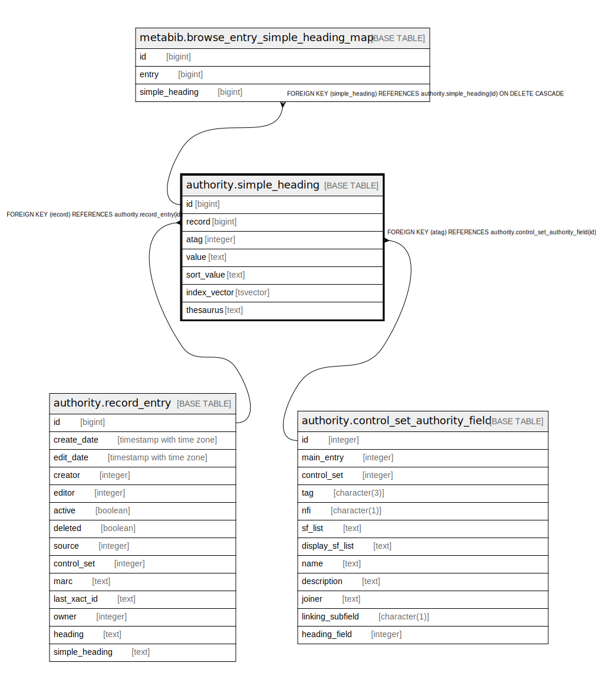

# authority.simple_heading

## Description

## Columns

| Name | Type | Default | Nullable | Children | Parents | Comment |
| ---- | ---- | ------- | -------- | -------- | ------- | ------- |
| id | bigint | nextval('authority.simple_heading_id_seq'::regclass) | false | [metabib.browse_entry_simple_heading_map](metabib.browse_entry_simple_heading_map.md) |  |  |
| record | bigint |  | false |  | [authority.record_entry](authority.record_entry.md) |  |
| atag | integer |  | false |  | [authority.control_set_authority_field](authority.control_set_authority_field.md) |  |
| value | text |  | false |  |  |  |
| sort_value | text |  | false |  |  |  |
| index_vector | tsvector |  | false |  |  |  |
| thesaurus | text |  | true |  |  |  |

## Constraints

| Name | Type | Definition |
| ---- | ---- | ---------- |
| simple_heading_atag_fkey | FOREIGN KEY | FOREIGN KEY (atag) REFERENCES authority.control_set_authority_field(id) |
| simple_heading_record_fkey | FOREIGN KEY | FOREIGN KEY (record) REFERENCES authority.record_entry(id) |
| simple_heading_pkey | PRIMARY KEY | PRIMARY KEY (id) |

## Indexes

| Name | Definition |
| ---- | ---------- |
| simple_heading_pkey | CREATE UNIQUE INDEX simple_heading_pkey ON authority.simple_heading USING btree (id) |
| authority_simple_heading_index_vector_idx | CREATE INDEX authority_simple_heading_index_vector_idx ON authority.simple_heading USING gin (index_vector) |
| authority_simple_heading_record_idx | CREATE INDEX authority_simple_heading_record_idx ON authority.simple_heading USING btree (record) |
| authority_simple_heading_sort_value_idx | CREATE INDEX authority_simple_heading_sort_value_idx ON authority.simple_heading USING btree (sort_value) |
| authority_simple_heading_thesaurus_idx | CREATE INDEX authority_simple_heading_thesaurus_idx ON authority.simple_heading USING btree (thesaurus) |
| authority_simple_heading_value_idx | CREATE INDEX authority_simple_heading_value_idx ON authority.simple_heading USING btree (value) |

## Triggers

| Name | Definition |
| ---- | ---------- |
| authority_simple_heading_fti_trigger | CREATE TRIGGER authority_simple_heading_fti_trigger BEFORE INSERT OR UPDATE ON authority.simple_heading FOR EACH ROW EXECUTE PROCEDURE oils_tsearch2('keyword') |

## Relations

---

> Generated by [tbls](https://github.com/k1LoW/tbls)
