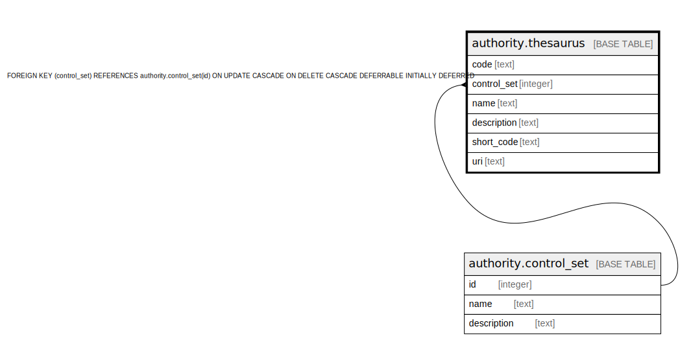

# authority.thesaurus

## Description

## Columns

| Name | Type | Default | Nullable | Children | Parents | Comment |
| ---- | ---- | ------- | -------- | -------- | ------- | ------- |
| code | text |  | false |  |  |  |
| control_set | integer |  | true |  | [authority.control_set](authority.control_set.md) |  |
| name | text |  | false |  |  |  |
| description | text |  | true |  |  |  |
| short_code | text |  | true |  |  |  |
| uri | text |  | true |  |  |  |

## Constraints

| Name | Type | Definition |
| ---- | ---- | ---------- |
| thesaurus_control_set_fkey | FOREIGN KEY | FOREIGN KEY (control_set) REFERENCES authority.control_set(id) ON UPDATE CASCADE ON DELETE CASCADE DEFERRABLE INITIALLY DEFERRED |
| thesaurus_name_key | UNIQUE | UNIQUE (name) |
| thesaurus_pkey | PRIMARY KEY | PRIMARY KEY (code) |

## Indexes

| Name | Definition |
| ---- | ---------- |
| thesaurus_name_key | CREATE UNIQUE INDEX thesaurus_name_key ON authority.thesaurus USING btree (name) |
| thesaurus_pkey | CREATE UNIQUE INDEX thesaurus_pkey ON authority.thesaurus USING btree (code) |

## Triggers

| Name | Definition |
| ---- | ---------- |
| thes_code_tracking_trigger | CREATE TRIGGER thes_code_tracking_trigger AFTER UPDATE ON authority.thesaurus FOR EACH ROW EXECUTE PROCEDURE oils_i18n_code_tracking('at') |

## Relations

---

> Generated by [tbls](https://github.com/k1LoW/tbls)
