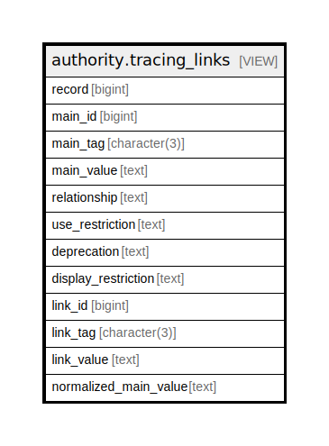

# authority.tracing_links

## Description

<details>
<summary><strong>Table Definition</strong></summary>

```sql
CREATE VIEW tracing_links AS (
 SELECT main.record,
    main.id AS main_id,
    main.tag AS main_tag,
    oils_xpath_string((('//*[@tag="'::text || (main.tag)::text) || '"]/*[local-name()="subfield"]'::text), are.marc) AS main_value,
    substr(link.value, 1, 1) AS relationship,
    substr(link.value, 2, 1) AS use_restriction,
    substr(link.value, 3, 1) AS deprecation,
    substr(link.value, 4, 1) AS display_restriction,
    link.id AS link_id,
    link.tag AS link_tag,
    oils_xpath_string((('//*[@tag="'::text || (link.tag)::text) || '"]/*[local-name()="subfield"]'::text), are.marc) AS link_value,
    are.heading AS normalized_main_value
   FROM ((((authority.full_rec main
     JOIN authority.record_entry are ON ((main.record = are.id)))
     JOIN authority.control_set_authority_field main_entry ON (((main_entry.tag = main.tag) AND (main_entry.main_entry IS NULL) AND (main.subfield = 'a'::text))))
     JOIN authority.control_set_authority_field sub_entry ON ((main_entry.id = sub_entry.main_entry)))
     JOIN authority.full_rec link ON (((link.record = main.record) AND (link.tag = sub_entry.tag) AND (link.subfield = 'w'::text))))
)
```

</details>

## Columns

| Name | Type | Default | Nullable | Children | Parents | Comment |
| ---- | ---- | ------- | -------- | -------- | ------- | ------- |
| record | bigint |  | true |  |  |  |
| main_id | bigint |  | true |  |  |  |
| main_tag | character(3) |  | true |  |  |  |
| main_value | text |  | true |  |  |  |
| relationship | text |  | true |  |  |  |
| use_restriction | text |  | true |  |  |  |
| deprecation | text |  | true |  |  |  |
| display_restriction | text |  | true |  |  |  |
| link_id | bigint |  | true |  |  |  |
| link_tag | character(3) |  | true |  |  |  |
| link_value | text |  | true |  |  |  |
| normalized_main_value | text |  | true |  |  |  |

## Referenced Tables

| Name | Columns | Comment | Type |
| ---- | ------- | ------- | ---- |
| [authority.full_rec](authority.full_rec.md) | 8 |  | BASE TABLE |
| [authority.record_entry](authority.record_entry.md) | 14 |  | BASE TABLE |
| [authority.control_set_authority_field](authority.control_set_authority_field.md) | 12 |  | BASE TABLE |

## Relations



---

> Generated by [tbls](https://github.com/k1LoW/tbls)
