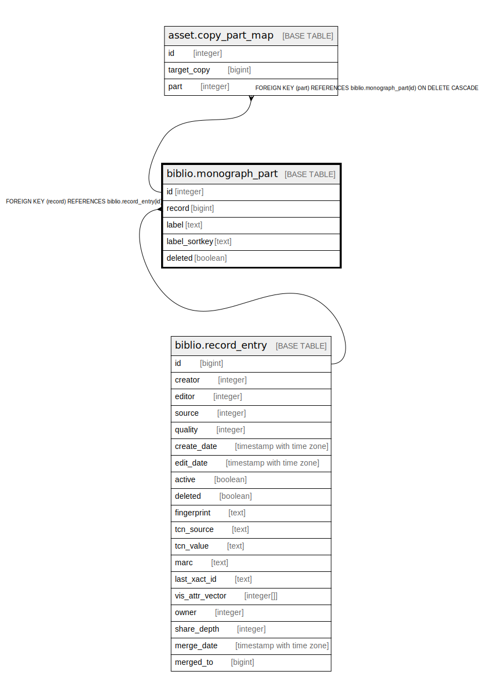

# biblio.monograph_part

## Description

## Columns

| Name | Type | Default | Nullable | Children | Parents | Comment |
| ---- | ---- | ------- | -------- | -------- | ------- | ------- |
| id | integer | nextval('biblio.monograph_part_id_seq'::regclass) | false | [asset.copy_part_map](asset.copy_part_map.md) |  |  |
| record | bigint |  | false |  | [biblio.record_entry](biblio.record_entry.md) |  |
| label | text |  | false |  |  |  |
| label_sortkey | text |  | false |  |  |  |
| deleted | boolean | false | false |  |  |  |

## Constraints

| Name | Type | Definition |
| ---- | ---- | ---------- |
| monograph_part_pkey | PRIMARY KEY | PRIMARY KEY (id) |
| monograph_part_record_fkey | FOREIGN KEY | FOREIGN KEY (record) REFERENCES biblio.record_entry(id) |

## Indexes

| Name | Definition |
| ---- | ---------- |
| monograph_part_pkey | CREATE UNIQUE INDEX monograph_part_pkey ON biblio.monograph_part USING btree (id) |
| record_label_unique_idx | CREATE UNIQUE INDEX record_label_unique_idx ON biblio.monograph_part USING btree (record, label) WHERE (deleted = false) |

## Triggers

| Name | Definition |
| ---- | ---------- |
| norm_sort_label | CREATE TRIGGER norm_sort_label BEFORE INSERT OR UPDATE ON biblio.monograph_part FOR EACH ROW EXECUTE PROCEDURE biblio.normalize_biblio_monograph_part_sortkey() |

## Relations

---

> Generated by [tbls](https://github.com/k1LoW/tbls)
