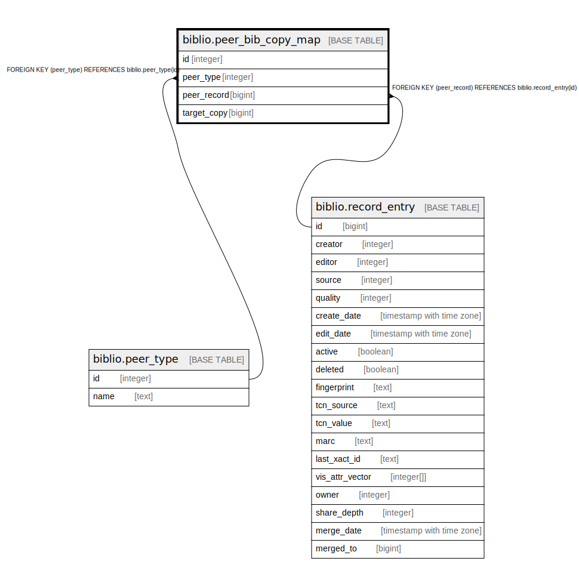

# biblio.peer_bib_copy_map

## Description

## Columns

| Name | Type | Default | Nullable | Children | Parents | Comment |
| ---- | ---- | ------- | -------- | -------- | ------- | ------- |
| id | integer | nextval('biblio.peer_bib_copy_map_id_seq'::regclass) | false |  |  |  |
| peer_type | integer |  | false |  | [biblio.peer_type](biblio.peer_type.md) |  |
| peer_record | bigint |  | false |  | [biblio.record_entry](biblio.record_entry.md) |  |
| target_copy | bigint |  | false |  |  |  |

## Constraints

| Name | Type | Definition |
| ---- | ---- | ---------- |
| peer_bib_copy_map_pkey | PRIMARY KEY | PRIMARY KEY (id) |
| peer_bib_copy_map_peer_type_fkey | FOREIGN KEY | FOREIGN KEY (peer_type) REFERENCES biblio.peer_type(id) |
| peer_bib_copy_map_peer_record_fkey | FOREIGN KEY | FOREIGN KEY (peer_record) REFERENCES biblio.record_entry(id) |

## Indexes

| Name | Definition |
| ---- | ---------- |
| peer_bib_copy_map_pkey | CREATE UNIQUE INDEX peer_bib_copy_map_pkey ON biblio.peer_bib_copy_map USING btree (id) |
| peer_bib_copy_map_copy_idx | CREATE INDEX peer_bib_copy_map_copy_idx ON biblio.peer_bib_copy_map USING btree (target_copy) |
| peer_bib_copy_map_record_idx | CREATE INDEX peer_bib_copy_map_record_idx ON biblio.peer_bib_copy_map USING btree (peer_record) |

## Triggers

| Name | Definition |
| ---- | ---------- |
| z_opac_vis_mat_view_tgr | CREATE TRIGGER z_opac_vis_mat_view_tgr AFTER INSERT OR DELETE ON biblio.peer_bib_copy_map FOR EACH ROW EXECUTE PROCEDURE asset.cache_copy_visibility() |

## Relations

---

> Generated by [tbls](https://github.com/k1LoW/tbls)
