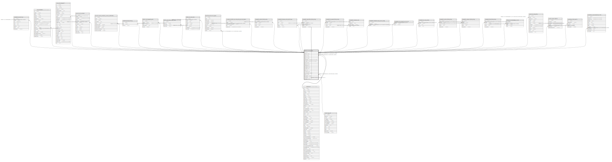

# biblio.record_entry

## Description

## Columns

| Name | Type | Default | Nullable | Children | Parents | Comment |
| ---- | ---- | ------- | -------- | -------- | ------- | ------- |
| id | bigint | nextval('biblio.record_entry_id_seq'::regclass) | false | [metabib.real_full_rec](metabib.real_full_rec.md) [acq.lineitem](acq.lineitem.md) [acq.user_request](acq.user_request.md) [asset.call_number](asset.call_number.md) [asset.course_module_course_materials](asset.course_module_course_materials.md) [biblio.record_entry](biblio.record_entry.md) [authority.bib_linking](authority.bib_linking.md) [biblio.monograph_part](biblio.monograph_part.md) [biblio.peer_bib_copy_map](biblio.peer_bib_copy_map.md) [biblio.record_note](biblio.record_note.md) [booking.resource_type](booking.resource_type.md) [container.biblio_record_entry_bucket_item](container.biblio_record_entry_bucket_item.md) [metabib.author_field_entry](metabib.author_field_entry.md) [metabib.browse_entry_def_map](metabib.browse_entry_def_map.md) [metabib.identifier_field_entry](metabib.identifier_field_entry.md) [metabib.keyword_field_entry](metabib.keyword_field_entry.md) [metabib.metarecord](metabib.metarecord.md) [metabib.metarecord_source_map](metabib.metarecord_source_map.md) [metabib.record_attr_vector_list](metabib.record_attr_vector_list.md) [metabib.record_sorter](metabib.record_sorter.md) [metabib.series_field_entry](metabib.series_field_entry.md) [metabib.subject_field_entry](metabib.subject_field_entry.md) [metabib.title_field_entry](metabib.title_field_entry.md) [rating.record_badge_score](rating.record_badge_score.md) [serial.record_entry](serial.record_entry.md) [serial.subscription](serial.subscription.md) [vandelay.bib_match](vandelay.bib_match.md) [vandelay.queued_bib_record](vandelay.queued_bib_record.md) |  |  |
| creator | integer | 1 | false |  | [actor.usr](actor.usr.md) |  |
| editor | integer | 1 | false |  | [actor.usr](actor.usr.md) |  |
| source | integer |  | true |  |  |  |
| quality | integer |  | true |  |  |  |
| create_date | timestamp with time zone | now() | false |  |  |  |
| edit_date | timestamp with time zone | now() | false |  |  |  |
| active | boolean | true | false |  |  |  |
| deleted | boolean | false | false |  |  |  |
| fingerprint | text |  | true |  |  |  |
| tcn_source | text | 'AUTOGEN'::text | false |  |  |  |
| tcn_value | text | biblio.next_autogen_tcn_value() | false |  |  |  |
| marc | text |  | false |  |  |  |
| last_xact_id | text |  | false |  |  |  |
| vis_attr_vector | integer[] |  | true |  |  |  |
| owner | integer |  | true |  | [actor.org_unit](actor.org_unit.md) |  |
| share_depth | integer |  | true |  |  |  |
| merge_date | timestamp with time zone |  | true |  |  |  |
| merged_to | bigint |  | true |  | [biblio.record_entry](biblio.record_entry.md) |  |

## Constraints

| Name | Type | Definition |
| ---- | ---- | ---------- |
| biblio_record_entry_owner_fkey | FOREIGN KEY | FOREIGN KEY (owner) REFERENCES actor.org_unit(id) DEFERRABLE INITIALLY DEFERRED |
| biblio_record_entry_creator_fkey | FOREIGN KEY | FOREIGN KEY (creator) REFERENCES actor.usr(id) DEFERRABLE INITIALLY DEFERRED |
| biblio_record_entry_editor_fkey | FOREIGN KEY | FOREIGN KEY (editor) REFERENCES actor.usr(id) DEFERRABLE INITIALLY DEFERRED |
| record_entry_merged_to_fkey | FOREIGN KEY | FOREIGN KEY (merged_to) REFERENCES biblio.record_entry(id) |
| record_entry_pkey | PRIMARY KEY | PRIMARY KEY (id) |

## Indexes

| Name | Definition |
| ---- | ---------- |
| record_entry_pkey | CREATE UNIQUE INDEX record_entry_pkey ON biblio.record_entry USING btree (id) |
| biblio_record_entry_create_date_idx | CREATE INDEX biblio_record_entry_create_date_idx ON biblio.record_entry USING btree (create_date) |
| biblio_record_entry_creator_idx | CREATE INDEX biblio_record_entry_creator_idx ON biblio.record_entry USING btree (creator) |
| biblio_record_entry_edit_date_idx | CREATE INDEX biblio_record_entry_edit_date_idx ON biblio.record_entry USING btree (edit_date) |
| biblio_record_entry_editor_idx | CREATE INDEX biblio_record_entry_editor_idx ON biblio.record_entry USING btree (editor) |
| biblio_record_entry_fp_idx | CREATE INDEX biblio_record_entry_fp_idx ON biblio.record_entry USING btree (fingerprint) |
| biblio_record_unique_tcn | CREATE UNIQUE INDEX biblio_record_unique_tcn ON biblio.record_entry USING btree (tcn_value) WHERE ((deleted = false) OR (deleted IS FALSE)) |

## Triggers

| Name | Definition |
| ---- | ---------- |
| a_marcxml_is_well_formed | CREATE TRIGGER a_marcxml_is_well_formed BEFORE INSERT OR UPDATE ON biblio.record_entry FOR EACH ROW EXECUTE PROCEDURE biblio.check_marcxml_well_formed() |
| aaa_indexing_ingest_or_delete | CREATE TRIGGER aaa_indexing_ingest_or_delete AFTER INSERT OR UPDATE ON biblio.record_entry FOR EACH ROW EXECUTE PROCEDURE biblio.indexing_ingest_or_delete() |
| audit_biblio_record_entry_update_trigger | CREATE TRIGGER audit_biblio_record_entry_update_trigger AFTER DELETE OR UPDATE ON biblio.record_entry FOR EACH ROW EXECUTE PROCEDURE auditor.audit_biblio_record_entry_func() |
| b_maintain_901 | CREATE TRIGGER b_maintain_901 BEFORE INSERT OR UPDATE ON biblio.record_entry FOR EACH ROW EXECUTE PROCEDURE maintain_901() |
| bbb_simple_rec_trigger | CREATE TRIGGER bbb_simple_rec_trigger AFTER INSERT OR DELETE OR UPDATE ON biblio.record_entry FOR EACH ROW EXECUTE PROCEDURE reporter.simple_rec_trigger() |
| c_maintain_control_numbers | CREATE TRIGGER c_maintain_control_numbers BEFORE INSERT OR UPDATE ON biblio.record_entry FOR EACH ROW EXECUTE PROCEDURE maintain_control_numbers() |
| fingerprint_tgr | CREATE TRIGGER fingerprint_tgr BEFORE INSERT OR UPDATE ON biblio.record_entry FOR EACH ROW EXECUTE PROCEDURE biblio.fingerprint_trigger('eng', 'BKS') |
| z_opac_vis_mat_view_tgr | CREATE TRIGGER z_opac_vis_mat_view_tgr BEFORE INSERT OR UPDATE ON biblio.record_entry FOR EACH ROW EXECUTE PROCEDURE asset.cache_copy_visibility() |

## Relations

---

> Generated by [tbls](https://github.com/k1LoW/tbls)
